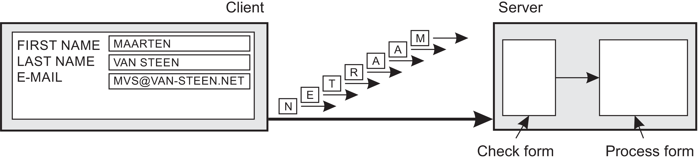
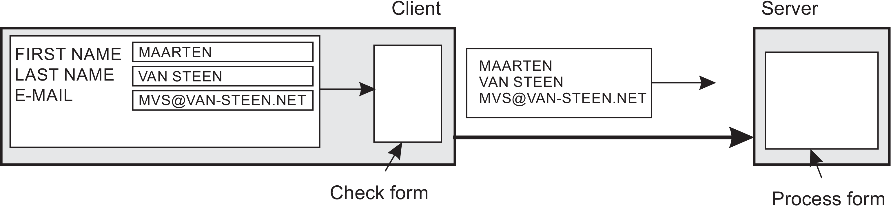
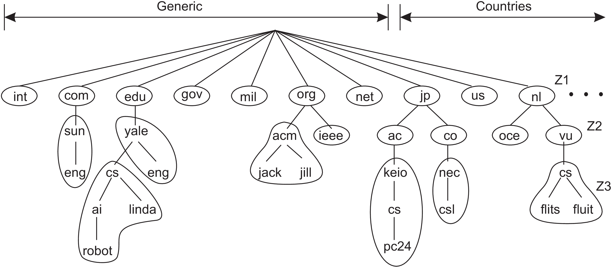

# Design goals

* はじめに
  * 分散システムはただ単に実装ができれば良いというわけではない
  * 以下の4つの目標について説明する   
  １. リソースの共有を支援すべき  
  ２. リソースがネットワークにまたがって分散されていることを隠すべき  
  ３. 開放型であるべき  
  ４. スケーラブルであるべき  

 

## リソースの共有を支援する
* ここでのリソースとは  
  * 周辺機器，データ，ファイル，サービス，ネットワークなどが，なんでも対象になる  
* リソースを共有すべき理由  
  * 一人でストレージ・システムを購入して運用するより，高機能な信頼性のあるストレージを共有した方が経済的になるから  
* つながるということ     　
  * 今ではインターネットを使ってメールや音楽や動画をやりとりすることができる  
  * グループウェア（SNSやメールなどの共有ソフト）によって多くの人が世界中で共同で作業をすることが可能になった  
* 分散システムとしてのリソース共有で思いつくこと  
  * ビットトレントなどのP2Pファイル共有ではないだろうか  
  * P2Pは音声や動画などと関連して考えられるのではないだろうか  
  * 他は，ソフトウェアのアップデートやバックアップなどの他のサーバとの同期  

 
 

## 透過的に分散すること  
* 透過性とは  
  * プロセスやリソースが複数のコンピュータにまたがって物理的に分散されていることをユーザやアプリケーションに気づかれないようにする
* 透過性の種類  
 ここでいうオブジェクトとは，プロセスやリソースのことを指します

透過性|説明   
---|---   
Access|データ表現やオブジェクトへの接続の違いを隠す  
Location（位置）|オブジェクトがどこに位置しているかを隠す  
Relocation（再配置）|使っている間にオブジェクトが違う場所に再配置されていることも隠す
Migration（移動）|オブジェクトが違う場所に移動したかもしれないことを隠す
Replication（複製）|オブジェクトが複製されていることを隠す
Concurrency（並行性）|オブジェクトが何人かの独立したユーザによって共有されているかもしれないことを隠す
Failure（障害）|オブジェクトの障害やリカバリを隠す

* 透過的なアクセス
	  * マシンやアーキテクチャの違いは隠して欲しいと思うはず  
	  * マシンやOSに代表される異なるデータ方式を統一する　　
	    * ファイルの命名規則やファイル操作，もしくは低次元でのプロセスのやり取りの違い  

 

* 配置先と再配置の透過性
  * システムにおけるオブジェクトの実体の配置先はユーザが分からないようにする   
  * 例）ネーミングサービス  
    * URL（"http://www.prenhall.com/index.html"）は Prenhall社のWebサーバの実際の場所を示すわけではない  
    * index.htmlがいつも同じ場所にあって，最近別の場所に再配置されたかどうかを教えてくれるわけでもない  
    * 特に，再配置の透過性の考えは後に説明するクラウドコンピューティングの章では特に重要  

 

* 移動（Migraion）の透過性　　
  * ユーザによって開始されたプロセスやリソースが通信中や操作中でも影響がないことを支援する  
    * 携帯電話は別の場所にいても，移動しながらでも会話できる  
    * 品物が移動している形跡は，モバイルデバイスを使うことでオンラインで追跡することができる

 

* 複製（Replication）の透過性  
  * 複製のメリット  
    * よく利用されるリソースの近くにコピーを置くことで性能を上げることができる   
    * 他が故障してもう一方が引き継ぐことができる
  * 複製を実装するうえで
    * コピーの実体を隠す必要がある
    * 全てのレプリカ（複製）は同じ名前をつけないといけない  
    * つまり，複製を透過するということは位置の透過性を支援することと同じ  

 

* 並行（Concurrency）の透過性  
  * リソースの共有は重要な目標だが，競合の場面が考えれる  
    * 二人のユーザは同じファイルサーバにデータを保管するかもしれない　　
    * 共有のデータベースの同じテーブルにアクセスするかもしれない   
  * 他の人が同じリソースを使っていることを感知しないようにすることが重要（透過的な並行性）    
  * 並行アクセスでも一貫した状態のままにすることが重要
    * 単純な方法：ロックメカニズムで排他的にすることで実現する
    * 洗練された方法：トランザクションを使用する
    * （分散システムにおいてのトランザクションの実装は難しく，スケーラビリティを考慮する場合では特に難しい ）  

 

* 障害（Failure）の透過性
  * ユーザもしくはアプリケーションにシステムの一部分の故障に気づかせてはいけない
    * 障害から自動的に復旧して動き続ける必要がある
  * 障害は分散システムにおいて最も厳しい課題の一つ
    * 現実的な方法の仮説については8章で説明するが不可能でもある
  * 障害を隠すことや透過的な復旧が難しい理由  
    * プロセスが死んでいるのか，返答が遅いのかを区別しにくい
    * 例）Webサーバがビジー状態の時にブラウザが接続すると，タイムアウト，もしくはWebページが使えないかを報告するが．ユーザは本当にサーバがダウンしているのか，ネットワークが混雑しているのかは分からない

 
 

## 透過度の度合い
 分散透過性は全てにおいて好ましいと考えられるが，全てをユーザから隠してしまう考えは良くない  
* 全てを隠すことが好ましくない例え  
  １. 別のタイムゾーンにいる時にいつものように午前7時に電子新聞が送られてくるが，タイムゾーンが違うため，いつものようには送られないだろう  

  ２. サンフランシスコとオランダのアムステルダムを繋ぐ広域分散システムは35ミリ秒以内で通信できないということを隠すことは不可能（信号伝達にはスイッチの遅延などが発生して数百ミリ秒はかかってしまう）
* 透過度の度合いと性能の間には別の兼ね合いがある
  * 例）インターネットを使ったアプリケーションはサーバと繰り返し接続を行うが，全ての接続の前に障害を隠蔽する処理を行う場合
    * 結果的に全体の性能を低下させてしまうかもしれない  
  * 例）異なる大陸に配置されているレプリカが同じ時間で必ず一貫することを保証しようとする場合　　
    * 単一の更新操作が数秒で完了させることはできず，ユーザから隠すことは不可能

* 全てにおいて透過性を目指すことが良い目標ではなく，性能のような他の課題と一緒に考える必要がある

 
 

## 開放性
開放された分散システムとは，システムを構成するコンポーネントが他のシステムに簡単に組み込まれたとしても使えるようになっている必要があり，また，分散システムは他の場所で使われていたコンポーネントによって構成されることがよくある

##### 相互運用性，合成可能性，拡張性
* コンポーネントはシンタックスやセマンティクスなどの標準規則に従うことが求めれる（このサービスが何を提供するのかを示す必要がある）
  * 一般的にはIDL（Interface Definition Language）などが使われる
    * RPCの実装時にOSの違いを吸収
    * C++とJavaのやり取りなどの言語の違いの吸収
  * インタフェースは引数の型や戻り値や例外などのシンタックスを規定する．
  * どのような動作を提供するかといったセマンティクスについては，現実的には自然言語で定義（ドキュメント化）することが可能
* 適切な仕様は中立であること
  * インタフェース定義は異なる組織が異なるインタフェースの実装を行っても，同じ方法で利用することができる（必要な機能は完全に明記されている）

完全性と中立は相互運用性や可搬性において重要である [Blair and Stefani,1998]

* 相互運用性（Interoperability）
  * 共通のプロトコルなどの標準化によって互いのサービスの動作を信頼することで共同作業できる
* 可搬性（Portability）
  * 分散システムAのため開発されたアプリが修正なしにAと同じインタフェースを利用した分散システムB上で実行できる
* 重要なもう一つのゴールとしての柔軟性
  * 異なる開発者による異なる部品からでも開発しやすくする
  * 他のコンポーネントに影響を与えずに，新しい機能を追加したり交換することが容易であるべき（拡張性）

 
 

#### メカニズムからポリシーの分離  
柔軟性を実現するためには小さいコンポーネントの集合として構成する必要がある
* インタフェースは単にユーザやアプリから見た高次元での提供だけでなく，システムの中核の部品としてや部品の相互作用がどうであるかを示すべき（こういったアプローチは比較的新しい）
  * 多くの古いシステムはモノリシックなアプローチで論理的に巨大なプログラムに分かれていた
  
  * モノリシックだと構成要素を交換したり適合することは難しいため，閉鎖型となる
* 特定のユーザやアプリケーションに依存しないようにすべき

 

* 分散システムにおいて変更が必要な場面とは特定のユーザやアプリにとって最適なポリシーを提供できない場合である
  * 例）ブラウザのキャッシュ
    * ストレージ：どこにキャッシュする？普通ならメモリだが，ディスクにする場合はローカルファイルシステムの位置を考慮する必要がある
    * 削除：キャッシュがいっぱいになった場合，どのデータを削除して新しいページを保存するのか？
    * 共有：各ブラウザはプライベートキャッシュを使うのか，ユーザで共有するのか？
    * リフレッシング：ブラウザはキャッシュの更新をいつ確認するのか？失効されたデータを返答するリスクもある
      * 更新レートは何をキャッシュするかに依存する
      * 例）列車の時刻表は変更しにくいが，高速の渋滞情報や株価はキャッシュすべきでない

 

* 必要なのはポリシーとメカニズムの分離
    * キャッシュの例
      * ブラウザはドキュメントを格納できる機能だけを持っており，ユーザはどのドキュメントをどのくらいキャッシュするか指定させるべき
      * 実際には，ユーザがパラメータを動的に設定できるように実装すると良い
      * さらには，ユーザが別のコンポーネントとして実装したポリシーをブラウザはプラグインとして使うための機能を提供できると良い

 
 

## スケーラビリティ
* 背景
  * 多くの人にとって世界中がインターネットで接続されることは，世界中にハガキを送ることと同じくらい一般的である  
  * 最近までは比較的協力なデスクトップコンピュータを利用していたが，アプリやサービスは「クラウド」と呼ばれるものに組み込まれた
  * タブレットなどのネットワーク対応の小型デバイスにより，スケーラビリティは分散システムの開発者にとって最も重要な設計目標の一つになっている

 
 

#### スケーラビリティの次元
* スケーラビリティは少なくとも三つに分けられる（[Neuman, 1994]）
  * サイズ・スケーラビリティ：
  ユーザやリソースを追加してもパフォーマンスを損なわない
  * 地理的・スケーラビリティ：
  ユーザとリソースが離れているシステムにおいても通信遅延が顕著にならない
  * 管理上のスケーラビリティ：
  複数の独立した管理組織（ドメイン）にまたがっていても簡単に管理できる

 
 

##### サイズ・スケーライビリティ
  * 大量のユーザやリソースをサポートする必要がある場面では，様々な状況で集中サービスの限界に直面する
    * ダメな例）分散システム内の特定のマシン上でのみ実行されるように実装されたサービス
    * ダメな例）物理的に同じ場所に配置されたマシンのクラスタ上にコラボレーションサーバのグループを持つ（一つのマシン上で分散システムを構築しても意味がない）
  * 単一のマシンで考えた場合，ボトルネックになる原因は３つ
    * 計算能力はCPUによって制限される
    * ストレージはI/O転送レートによって制限される
    * ユーザとサービス間のネットワーク
  * 計算能力の問題
    * 例）リアルタイムな交通情報を考慮したルート検索サービス
      * 通常はリクエスト完了に数十秒かかるとは思えないが，利用可能なマシンが１台しかない場合にはリクエストが増大して問題が発生してしまう
  * I/O性能の問題
    * 例）設計が不十分な検索エンジン
    * コンテンツベースでの検索クエリをデータセット全体に対して一致する必要があるとする
      * 高度な牽引技術を利用しても，メモリを超える膨大なデータを処理する問題に直面する
      * より高速なディスクを追加しただけでは持続的な解決策とはならない
  * ユーザとサービス間のネットワークの問題
    * 例）高品質のビデオをストリーミングする
      * 8~10Mbpsの帯域が必要になり，ネットワーク容量の限界に達する可能性がある

 
 

#### 地理的なスケーライビリティ  
  * 地理的なスケーラビリティには独自の問題が存在する
    * LAN用に設計された分散システムを拡張することは難しい（同期通信の考えが基になるため）
      * 一般的にはサーバから返信が返るまでロックする
      * データベーストランザクションなどのブロックを行うやり方
      * 一般的に遅くとも数百マイクロ秒で通信できるLANでうまく機能する
    * ワイドエリアシステムでは，プロセス間通信が数百ミリ秒と3桁も遅くなることを考慮しなければならない
    * 広域システムで同期通信を使用する場合は大きな注意が必要
  * もう一つの問題
    * WANでの通信がLANより信頼性が低いこと
    * 帯域なども考慮するため，簡単には移植することはできない
    * 例）ストリーミングビデオ
      * 無線を使って家のサーバからディスプレイまで高速ストリームを確保することは簡単
      * しかし，単に同じサーバを遠くにおいて使用するだけで帯域制限が現れて頭をかかえる可能性がある
  * さらにもう一つの問題
    * ワイドエリアシステムでは多地点通信のための設備が限られている
      * LANは効率的なブロードキャストメカニズムがある
    * WANでは
      * ネーミングサービスやディレクトリサービスなど別々のサービスを開発する必要がある
      * これらのサービスは同様にスケーラブルである必要があり，明白な解決策はない

 
 

#### 管理上のスケーライビリティ
複数の独立した管理ドメインにまたがって分散システムをどのように拡張するか
  * リソースの使用と支払い，管理，セキュリティに関する相反するポリシーの問題が存在する
    * 計算グリッド（computational grid）のように高価な機器を共有するためのソリューションが研究されてきた
    * グリッドはグローバル分散システムをローカル分散システムの結合として構築される
    * 組織Aのコンピュータで実行されるプログラムが組織Bのリソースに直接アクセスできるようにする
      * 通常の分散システムは同じドメインのユーザを信頼するが，この場合システム管理者はアプリを調査して，改ざんされないような措置をとらなければいけない
      * ユーザはシステム管理者を信頼するが，ドメインを超えて信頼するわけではない

 

  * 分散システムが別のドメインに展開される場合2つのセキュリティ対策が必要  
    1. 新しいドメインからの攻撃を防ぐ必要がある  
      * 例）新しいドメインからのユーザは元のファイルシステムに対するアクセスしか持たないだろう
      * 高性能コンピュータなどの施設は許可されていないユーザには利用できないだろう
    2. 分散システムからの攻撃を防ぐ必要がある
      * 例）Webブラウザでアプレットなどのプログラムをダンロードする
        * 新しいドメインは外部コードがどんなものか分からない
      * どのように強制するかは詳しくは9章で議論する

 

  * 管理上のスケーラビリティの問題を抱えていない例
    * 例）ファイル共有P2Pネットワーク
      * エンドユーザは検索とダウンロード機能のプログラムをインストールするだけで十分
      * その他）Skype，Spotifyなどのストリーミングアプリ
    * 共通点として管理エンティティでなくエンドユーザが共有してシステムを稼働させ続ける
    * ISPなどが監視しようとしたが効果はなかった（管理者は必要ない）

 
 

### スケーリングテクニック
ほとんどの場合，分散システムのスケーラビリティの問題はサーバとネットワークの容量が限られるために発生するパフォーマンス上の問題のように見える
* メモリを増やす，CPUをアップグレードする，ネットワークモジュールを交換するなどのように単純に改善することは，スケーリングアップ（scaling up）と呼ばれる解決方法
* スケーリングアウト（scaling out）はマシンを増やして拡張する方法
  * 基本的にマシンを追加することで拡張は可能だが，３つの手法しか適用できない（Neuman[1994]）
    1. 通信遅延を隠す
    2. 作業の分散，
    3. レプリケーション  

* 通信遅延を隠すこと
  * 地理的スケーラビリティの場合に適している
    * 例）サービスが要求された場合，応答を待つ代わりに送信者側で他の作業を行うことができる
  * 非同期通信を使う
    * 応答が返ると，アプリを中断して以前の要求を完了するためのハンドラが呼び出される
    * 非同期通信は，バッチ処理システムや並列アプリケーションで使用されることが多い
    * あるいは新しいスレッドを開始してリクエストを実行することもできる．応答待ちをブロックするが，他のスレッドは続行できる
  * 非同期を使えないアプリも多くある
    * 例）インタラクティブなアプリ
      * リクエストに対して応答されるまで待たなければいけない
      * この場合は全体的な通信を減らす
      * 例）サーバで行っていた処理をクライアントで行う
    * （このアプローチの例）フォームを利用したデータベースアクセス
      * フォームの記入は図1.4(a)に示すようにメッセージを送信して，サーバからの確認応答を待つことで実行できる
      * この場合サーバはエントリを受け入れる前にシンタックスチェックを行うと良い
      * さらに良い解決方法は，図1.4(b)のようにクライアント側でチェックを行うようにすれば良い

  

  

 

* 分割（Partitoning)と分散
  * コンポーネントをより小さなパーツに分割し，それらをシステム全体に分散する
  * 例）DNS
    * NDSのネームスペースは図1.5のように重複しないゾーンに分割されたドメインのツリーに階層的に編成されている
    * 各パス名はインターネット上のホスト名と考えれられることができ，ホストのネットワークアドレスに関連付けられる
    * 名前を解決することは関連するホストのネットワークアドレスを返すことを意味する
    * 例）"flits.cs.vu.nl”という名前を考える
      1. 最初にゾーンZ1のサーバに渡され（図1.5），残りの名前
      "flits.cs.vu"のゾーンZ2のサーバアドレスが返される
      2. Z2のサーバはZ3のアドレスを返す
      3. Z3は名前の最後の部分を処理して関連するホストのアドレスを返す
    * この例では，ネーミングサービスが分散される方法を示したことから，単一のサーバが全ての名前解決の要求に対応する必要はない
    
  * 例）World Wide Web
    * 多くの人にとってWebは巨大な文書ベースの情報システムであるように見える
    * Webは物理的に分割されており，数千万のサーバに分散されて，それぞれが多数のWeb文書を処理している
    * ドキュメントを扱うサーバの名前はドキュメントのURLにエンコードされる
    * Webが現在の大きさまでにスケーリングできるのはこの文章の配布方法が要因です

 

* レプリケーション  
  * スケーラビリティの問題はパフォーマンス低下の形で現れることが多い
    * つまり，分散システム全体に渡ってコンポーネントを複製することは良い考えである
  * 可用性を高めるだけでなく負荷の分散にも役立つ
  * 地理的に広く分散しているシステムでは近くにコピーを置くと通信遅延の問題を隠すことができる
* キャッシュ
    * キャッシュは特別なレプリケーションの形である
    * キャッシングによってクライアントの近くにあるリソースのコピーが作成されるが
    * レプリケーションとは対照的に，キャッシュはクライアント側で決定され，リソースの所有者がキャッシュを決定するわけではない
* ただし，キャッシングとレプリケーションにはスケーラビリティに悪影響を与える重大な欠点が一つある
    * あるコピーを変更するともう一つとは異なる（一貫性の問題につながる）
    * どの程度許容できるかはリソースの使用に大きく依存する
      * 例）Webユーザはブラウザのキャッシュが最新でないものを返答することを容認している
      * 例）電子証券取引所やオークションは一貫性保証を満たす必要がある
    * 協力な一貫性は更新をすぐに全てのコピーに伝播する必要があり，さらに，二つの更新が発生した場合は，すべて同じ順序で処理されなければいけない
    * 可用性などの望ましい特性と一貫性を組み合わせることは単純に不可能な場合がある（第8章で詳しく議論する）
    * レプリケーションではグローバル同期機構が必要になる
      * このようなメカニズムはスケーラブルな方法で実装するのが非常に難しく不可能
      * レプリケーションによるスケーリングは本質的にスケーラブルではない他のソリューションを導入するかもしれない（第7章で再び説明する）

 

* 議論
  * スケーリング技術を考慮すると，サイズスケーラビリティが技術的に簡単
    * 多くの場合，マシンの容量を増やすことで可能だが，費用がかかる
  * 地理的スケーラビリティはネットワークレイテンシの制約があるため，はるかに難しい
    * 結果的にクライアントに近い場所に複製することが強制され，一貫性の問題が発生する
    * 実際には分散，複製，キャッシュの技術を一貫性と組み合わせて，一般に許容できる解決策が必要となる
  * 管理のスケーラビリティは最も難しい
    * 組織的な統制や人間の強調など，非技術的な問題に対処する必要がある
  * P2Pが現在広く普及していることはエンドユーザを制御化に置けることが実証できたから[Lua et al., 2005; Oram, 2001]
  * ただし，P2Pはすべての管理スケーラビリティの問題に対する普遍的なソリューションではない

 

* 落とし穴
  * 分散システムを開発することは大変な作業である
    * この本の中で何度も述べるように複雑な多くの問題が同時に検討しなければならない
    * にもかかわらず，幾つかの設計原則に従うことで，この章で述べた目標を強く遵守する分散システムを開発することができる
  * 分散システムはコンポーネントがネットワーク全体に分散されているため，従来のソフトウェアとは異なる
    * この分散を考慮しなければ，多くのシステムを不必要に複雑にし，後に修正する必要がある欠陥をもたらす原因となる
  * Sun Microsystemsで働いたPeter Deutschはこれらの欠陥を分散アプリケーションを初めて開発するときに多くの人が陥る誤った前提として定式化した
    1. ネットワークは信頼できる
    2. ネットワークはセキュアである
    3. ネットワークの質は安定している
    4. トポロジは変化しない
    5. レイテンシはゼロである
    6. 帯域幅は無限である
    7. 輸送コストはゼロである
    8. 管理者が1人はいる
  * これらの前提は分散システム特有の性質であり，非分散アプリケーションを開発する場合はこれらの問題のほとんどが表示されないかもしれない
  * 本書で議論する原則のほとんどはこれらの前提に関係している
