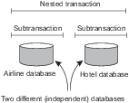
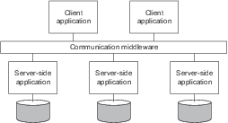

# 分散情報システム
* 多くの企業は多くのネットワークアプリケーションを管理しているが，相互運用性（異なるプログラム同士が，共通のプロトコルや情報交換の規則などを通じて相互にやり取りを行えること）で痛い目にあっている．
* ミドルウェアは相互運用性を解決してアプリケーションを簡単に統合するために導入されてきた．

 

* 統合については，幾つかのレベルに区別することができる．
  * 多くの場合，データベースなどのネットワークアプリケーションは，クライアントによりサーバに操作を依頼して，その結果を返答する．
  * 最も低いレベルでの統合により，クライアントは一つの大きなリクエストにラップして，分散トランザクションとして実行させることができる．

 

* 次のステップ
  * アプリケーションはより洗練され，徐々に独立したコンポーネントとなる
  （データベースの構成要素と処理要素は区別されるように）
  * アプリケーションが独立した場合，互いに直接通信できるように統合するべきことが明らかになった．
  * これはEAI（Enterprise Application Integration)につながる．

 

### 分散トランザクションプロセス
* 議論を明確にするため，データベースについて議論する．
* データベース上の操作はトランザクションの形で行われる．
* トランザクションを使用したプログラミングでのプリミティブ（基本操作）の例を以下表に示す．

| Primitive | 説明
|:-----: | :-----: |
| BEGIN_TEANSACTION | トランザクションの開始を示す |
| END_TRANSACTION | トランザクションの終了してコミットする |
| ABORT_TRANSACTION | トランザクションをKillして古い値を復元する |
| READ | データをファイルやテーブル，その他から読み込む |
| WRITE | データをファイルやテーブル，その他へ書き込む |

* READとWRITEは典型的な例である．
  * 通常のステートメントやprocedure callsなどは，トランザクション内でも使用できる．
  * 特に，RPC（remote procedure call）によるリモートサーバのプロシージャーコールは，トランザクションにカプセル化され，トランザクション・RPCと呼ばれるものにつながります．
  * RPCについては4.2節で議論する．
* BEGIN_TEANSACTIONと，END_TRANSACTIONはトランザクションの範囲を区切るために使われる．
* トランザクションの特徴はこれらの操作の全てが実行されるか，実行されないことです．

* このようなall-or-nothingはトンランザクションの持つ4つの特性の一つであり，
これらをトランザクションのACID特性と呼ぶ．
  *  Atomic(原子性)：自然界での取引は分けることができない（all-or-nothing）
  * Consistent(一貫性)：トランザクションはシステムの値が異なることを禁止する
  * Isolated(独立性)：同時に起きたトランザクションは互いに影響を受けない
  * Durable(耐久性):一度コミットされたら永続化する

* 分散システムでのトランザクションはしばしば幾つかのサブトランザクションによって構成される．
  * 図1.11に示すようにネストされたトランザクションを共同で形成する．

* トップレベルのトランザクションでは，子をフォークすることで異なるマシン上で互いに並行して実行することでパフォーマンスを向上させる．
  * それぞれの子はサブトランザクションを実行することも，子トランザクションをフォークすることもできる．

* サブトランザクションは微妙で重要な問題を引き起こす．
  * サブトランザクションがコミットしても，親が異常終了した場合には，トップレベルのトランザクションが開始される前の状態に戻さなければいけない．
  * つまり，永続性はトップレベルのトランザクションにしか適応されない．
* トランザクションは任意に深くネストできるため，全てを正しく行うにはかなりの管理が必要．
* しかし意味的には単純．
  * トランザクションが開始されると，システム全体の全てのデータのコピーを作成する．
  * もしも中断すれば，まるで存在しなかったかのようにコピーが消滅する．
  * したがって，サブトランザクションがコミットした後に新しいトランザクションが開始されると，2番目のトランザクションは最初のトランザクションによって生成された結果を表示する．
  * 同様に，包含している上位レベルのトランザクションが中止されると，その元となる全てのトランザクションも中止させる．

* ネストされたトンランザクションは，トランザクションを複数のマシン間で分散させる自然な方法を提供するため重要．
  * それらは，もとのトランザクションの論理的な分割に従う.
  * 例えば，三つの異なるフライトを予約する必要がある旅行を計画するトランザクションは三つのサブトランザクションに分割することができる．
  * それぞれのサブトランザクションのは，他の二つから独立して管理することができる．
* 分散トランザクションを処理するコンポーネントのことを，トランザクション処理モニター，またはTPモニターと呼ぶ．
  * 図1.12のようにアプリケーションがトランザクション・プログラミングモデルを提供することによって，複数のサーバ/データベースにアクセスするようになった．
  * TPモニターは8.5節で議論する分散コミットとよばれる標準プロトコルに従い，サブトランザクションのコミットメントを調整する．
* 重要なことは，複数のサブトランザクションを一つのトランザクションとして使うように調整が必要なアプリケーションでは，この調整自体を各自で実装する必要がない．

 
### エンタープライズアプリケーションの統合
* アプリケーションコンポーネントは，トランザクション処理システムによってサポートされた要求/応答動作だけでなく，互いに直接通信できる必要がある.
  * このアプリケーション間通信の必要性は，多くの異なる通信モデルをもたらした．
* 主な考え方は，図1.13に示すように，既存のアプリケーションが直接情報を交換できるということである．

* 幾つかの種類の通信ミドルウェアが存在する．
  * remote procedure calls（RPC）
    * アプリケーションコンポーネントは，リモートのlocal procedure callを実行することによって，別のアプリケーションコンポーネントに効果的にリクエストを送信できる．その結果，リクエストがメッセージとしてパッケージ化され，呼び出し先に送信される.
    * 同様に，結果はプロシージャコールの結果として返され，アプリケーションに返される．
  * remote method invocations（RMI）
    * オブジェクト技術の普及に伴い，リモートオブジェクトへの呼び出しを可能にする．
    * RMIは本質的にRPCと同じですが，機能の代わりにオブジェクトで動作する点が異なる．
* RPCとRMIには欠点があり，通信時に呼び出し元と呼び出し先の両方を起動して実行する必要がある．
* 加えて，互いを参照する方法を正確に知っている必要がある．

* この密な結合は深刻な欠点として頻繁に経験され，message-oriented middleware（MOM）と呼ばれるものにつながる．
  * MOMの場合，アプリケーションは論理的な接点にメッセージを送信します．
  * これらのいわゆるpublish/subscribeモデルは，分散システムの拡張された分類を形成する．

 
### パーベイシブシステム
* これまで説明した分散システムは，安定的（ノードは固定され，ネットワークへの永続的で高品質な接続を維持している状態）であることが大きく特徴付けられる．
* 安定的な状態は，ある程度，分散の透過性を達成するための様々な手法によって実現できる．
  * 例えば，故障が起きていないような錯覚を作り出すには，様々な方法があります．
  * 同様に，ノードの実際のネットワーク位置を隠すための様々な手段があり，ユーザーやアプリケーションからノードが存在したままだと思わせることもできる．
* しかしながら，モバイルおよび組み込みコンピューティングデバイスの導入以来，問題が変化した．

* パーベイシブ（普及）システムとは，その名前の通り自然界に溶け込むことを意図する．
  * これらは自然に分散したシステムでもあり，1.1節で示した特性を確実に満たす．
* これまで説明した情報システムと比較して独特なのは，ユーザーとシステムコンポーネントの分離がはるかに曖昧であること．
  * 画面/キーボードの組み合わせなどの単一の専用インターフェースは度々存在しない．
  * 代わりとして，ユーザーの行動を取り上げる多くのセンサーが装備されている．
  * パーベイシブシステムの多くのデバイスは，小型，バッテリ駆動，モバイル，ワイヤレス接続を特徴とする．
  * この役割はスマートフォンだけでなくInternet of Things（IoT）にも含まれる．
* 私たちがしばしば無線や移動通信の複雑さに対処する必要があるという事実から，パーベイシブシステムを可能な限り透過的にする特別なソリューションが必要．
* 以下では，3つのタイプに区別していますが，3つのタイプの間には重複がある．
  1. ユビキタス・コンピューティング・システム
  2. モバイル・システム
  3. センサー・ネットワークなど

#### ユビキタスコンピューティングシステム
* これまで，環境の多くの部分に溶け込んでいるという意味でパーベイシブシステムについて話した．
* ユビキタス・コンピューティング・システムはさらに一歩進んでいる．
  * ユーザーがシステムと継続的にやりとりすることを意味し，度々インタラクションが起こっていることを認識していないことさえある．
* Poslad [2009]は，次のようなユビキタスコンピューティングシステムのための要件を記述している．
  1. （分散）デバイスはネットワーク化され，分散され，透過的にアクセス可能
  2. （インタラクション）ユーザーとデバイスのインタラクションは必要ない
  3. （文脈認識）システムは，インタラクションを最適化するためにユーザの文脈を認識している
  4. （自立）デバイスは人間の介入なしに自律的に動作するため，高度に自己管理されている
  5. （知能）システム全体は，幅広いダイナミックな行動や相互作用を扱うことができる
* 分散システムの観点からこれらの要件を簡単に検討する．

1. 分散
  * 前述のように，ユビキタスコンピューティングシステムは分散システムの一例．
    * システムのノードを形成するデバイスおよび他のコンピュータは，単にネットワーク化され、共に作用して単一のコヒーレントシステムを形成する．
    * また，ユーザーに近いデバイス（センサーやアクチュエータなど）が見えなくなったり，クラウド内で遠隔操作しているコンピュータに接続したりすることもある．
  * したがって，第1.2節で述べた分散の透明性に関する要件のすべてではないにしても，大部分は保持すべき．
2. インタラクション
  * ユビキタスシステムは，ユーザーとのやりとりに関しては，今まで検討してきたシステムと比較した場合，特別な注意を払う必要があるという点で異なる．
  * ユビキタスシステムでは，人間によるインタラクションの多くは暗黙的なものであり，暗黙的な行動は「主としてコンピュータ化されたシステムと対話することを目的とせず，入力として理解することを目的とする」ものとして定義される　[Schmidt, 2000]．
  * 言い換えれば．ユーザは入力がコンピュータシステムから提供されているという事実をほとんど意識することができない．
    * つまり，ユビキタスコンピューティングは，一見インターフェースを隠すと言える．
    * 簡単な例は，自動車の運転席，ステアリングホイール，ミラーの設定が完全にパーソナライズされている場面．
      * ボブが座席に座った場合，システムはボブを認識して適切な調整を行う．
      * アリスが車を使用しているときも同じことが起こるが，未知のユーザーは個人の調整を行うようになる．
    * この例は，ユビキタスにおけるセンサーの重要な役割である．
      * つまり，センサーによる入力の分析（明らかに運転したい人物を特定）が行動（調整を行う）につながるために使用される入力デバイスとなる．
* 文脈認識
  * 感覚入力に反応するより，ユーザからの明示的な入力の方が簡単と言える．
  * ユビキタスシステムが必要とするのは，インタラクションを考慮した文脈を得ること．
  * 実際には文脈は，場所，身元，時間，活動によって特徴付けられることが多い．
      * 場所，人，いつ，そして何であるか． システムはこれらのコンテキストタイプの1つまたは複数を決定するために必要な（感覚的な）入力装置を持つ必要がある．
  * 分散システムの観点から重要なことは，さまざまなセンサーによって収集された生データがアプリケーションによって使用できる抽象レベルに持ち上げられること．
    * 具体的には，例えばGPS座標のように人物がどこにあるかを検出し，その後．その情報を道路の角，特定の店舗または他の既知の施設のような実際の場所にマッピングすることである．

4. 自律
    * ほとんどのユビキタスシステムの重要な側面は，明示的なシステム管理が最小限に抑えられていること．
    * ユビキタスコンピューティング環境では，システム管理者が全てを管理できない．
    * その結果，システム全体が自律的に行動し．自動的に変化に対応できるようにすべきである．
    * これには，数多くのテクニックが必要であり，いくつかの簡単な例を挙げて次のことを考える．
      * アドレスの割り当て：
        * ネットワークデバイスが通信するためには、IPアドレスが必要．
        * アドレスは、DHCP（Dynamic Host Configuration Protocol）またはZeroconfのようなプロトコルで自動的に割り当てられる．
      * デバイスの追加：
        * 既存のシステムにデバイスを追加するのは簡単．UPnP（Universal Plug and Play Protocol）は，自動構成に向けたステップを実現している．
        * UPnPを使用すると，デバイスは互いを検出し，デバイス間で通信チャネルを設定できる．
      * 自動アップデート：
        * ユビキタス・コンピューティング・システムの多くのデバイスは，ソフトウェアを更新する必要があるかどうかを定期的にインターネットでチェックできるはず．
        * 必要ならコンポーネントの新しいバージョンをダウンロードし，理想的には中断したところから続けることができる．

    * これらは非常に単純な例だが，手動での介入を最小限に抑える必要があることは明らかである．
    * 本書では，自律管理に関連する多くのテクニックについて詳しく説明します．
5. 知能
    * 最後に，Poslad [2009]は，ユビキタスコンピューティングシステムでは，人工知能分野の手法や手法を使用することが多いと述べている．
    * つまり，多くの場合，不完全な入力を処理したり，変化する環境に迅速に対応したり，予期しないイベントを処理したりするために高度なアルゴリズムとモデルを幅広く導入する必要がある．
    * これを分散して行うことができるかどうかは，分散システムの観点から重要です．
    * 残念なことに，人工知能の分野における多くの問題に対する分散ソリューションは未だ発見されていない．

#### モバイルコンピューティングシステム
  * 前述したように，移動性は広範囲にわたるシステムにおいて重要な要素である．
  * パーベイシブシステム全体にモバイルコンピューティングを置く場合，いくつかの問題がある．

  * 第1に（分散型）モバイルシステムの一部を形成するデバイスは大きく異なる可能性がある．
      * 通常，モバイルコンピューティングはスマートフォンやタブレットなどのデバイスで行われている．
      * しかし，リモートコントロール、ポケベル、アクティブバッジ、車載機器、さまざまなGPS対応デバイスなどが含まれまれる可能性がある．
      * これらのデバイスの特徴は，無線通信を使用することであり，異なるタイプのデバイスはIPを使用して通信している．

  * 第2にモバイルコンピューティングでは，デバイスの位置は時間と共に変化するとされる．
      * 位置が変化すると多くの問題に影響を与える．
          * 例えば，アプリケーションの追跡やトレースの場合，デバイスの実際の地理的座標を知る必要がある．
      * 場所の変更は通信にも大きな影響を与える．
        * 説明するために，一般的にMANET（モバイルアドホックネットワーク）を考える．
        * MANETの2つのデバイスが互いのアドレスを知っているという意味でお互いを発見したとする．
        * どのように2人の間でメッセージをルーティングしますか？静的ルートの場合，持続可能ではありません．
      * ここで扱っているのは，いわゆる破壊耐性ネットワーク．
        * 2つのノード間の接続性を単に保証することができないネットワークであり，別のノードからメッセージを取得することは，問題を抱えているかもしれない．
      * そのような場合のトリックは，ソースからデスティネーションへの通信経路を設定するのではなく，2つの原則に依拠する．
        * まず，4.4節で議論するように，特別なフラッディングベースの手法を使用すると，メッセージがネットワークの一部を介して次第に広がり，最終的に宛先に到達することが可能になる．明らかにどんなタイプのフラッディングも冗長なコミュニケーションをもたらすだろうが，これは我々が支払わなければならない対価かもしれない．
        * 第2に．中断のないネットワークでは．中間ノードに受信メッセージを格納させ，それを渡すことができる別のノードが出現するまで待つ．言い換えると，図1.14に示すように，ノードはメッセージの一時的なキャリアになる．そして，最終的にメッセージはその宛先に到達するはず．

  * 遭遇したノードに選択的にメッセージを渡すことが効率的な配信を保証するのに役立つかもしれないと考えるのは難しくない．
    * たとえば，ノードが特定のクラスに属していて，送信元と送信先が同じクラスに属している場合，そのクラスのノード間でのみメッセージを渡すことにする．
    * 同様に，よく接続されたノード，すなわち最近の過去に多くの他のノードの範囲内にあったノードにのみメッセージを渡すことが効率的であることが判明するかもしれない．Spyropoulos et al．[2010]．

#### センサーネットワーク
 * パーベイシブシステムの最後の例はセンサネットワーク．
 * センサネットワークを分散システムの観点から見て興味深いものである理由は，それらが単なる入力デバイスの集合ではないということである．
 * センサノードは，アプリケーション固有の方法で感知されたデータを効率的に処理するためにしばしば協働し，従来のコンピュータネットワークとは大きく異なる．

 * センサネットワークの特徴
  * センサネットワークは一般に，それぞれが1つまたは複数の検知デバイスを備えた数十から数百または数千の比較的小さなノードからなる．
  * 多くのセンサネットワークは無線通信を使用し，ノードのほとんどはバッテリ駆動である．
  * 限られたリソース，制限された通信機能，および制約された電力消費が要求される．
  * 個々のノードを注目すると，概念的に「通常の」コンピュータと大きく異なるわけではない．
  * ハードウェアの上には低レベルのネットワークアクセス，センサとアクチュエータへのアクセス，メモリ管理など，従来のオペレーティングシステムに似たソフトウェア層がある．

 * しかし，他のネットワーク化されたコンピュータシステムと同様に，センサネットワークアプリケーションを効果的に展開するためには，さらなるサポートが必要である．
  * 分散システムでは，これはミドルウェアの形をとる．
  * センサネットワークでは，ミドルウェアに注目するのではなく，MottolaとPicco [2011]によって広範に調査されたプログラミングサポートが提供されているのが良いだろう．

 * 具体的には，いわゆる抽象的な領域を使用して，ノードが近隣を識別できるようにする．たとえば，以下のように情報を収集する．
   1. region = k_nearest_region.create(8);
   2. reading = get_sensor_reading();
   3. region.putvar(reading_key, reading);
   4. max_id = region.reduce(OP_MAXID, reading_key);

  * 1行目では，ノードは最初に8つの最も近い近隣の領域を作成し，その後，そのセンサから値を取得する．
  * 読込みでは，その後，キーreading_keyを使用して定義された領域に書き込む．
  * 4行目では，ノードは定義された領域のセンサ読み取り値が最大であったかどうかをチェックしてmax_idに返す．

  * 関連するもう1つの例として，分散データベースを実装するセンサネットワークを考える．
  * このデータベースのビューは，計測および監視アプリケーション用に多くのセンサネットワークが導入されていることをイメージすると分かりやすい．
    * このような場合，オペレータは「サンタクルーズの高速道路の1号線の北向きの交通量はどうですか？」といったクエリを発行するだけで，ネットワークの一部から情報を抽出したいと考えるが．このようなクエリは従来のデータベースに似ている．
    * この場合，高速道路1号線に沿った多くのセンサーのコラボレーションを通じて，回答を提供する必要がある．

  * センサネットワークを分散データベースとして編成するには，図1.16に示すように2つの極端な例が挙げられる．
    * 第1に，センサは協力せず，オペレーターのサイトにある集中データベースにデータを送信するだけである．もう1つは，関連するセンサーにクエリを転送して，それぞれが答えを計算させてオペレータに応答を集計させることです。

  

  

  * これらの解決策のどちらも非常に魅力的ではない．
    * 一つ目の決法は，センサーが測定したすべてのデータをネットワーク経由で送信する必要があるため，ネットワークのリソースとエネルギーが浪費される可能性がある．
    * 二つ目の方法は，はるかに少ないデータをオペレータに返すことができるが，センサの集約能力を無視するため無駄である．
  * 必要とされるのはネットワーク内のデータ処理のための設備である．

  * ネットワーク内処理は様々な方法で実行できる．
  * 明確な方法の1つは，すべてのノードを含むツリーに沿ってすべてのセンサノードにクエリを転送し，その後，イニシエータが配置されているルートノードに伝搬された結果を集約することです．
    * 集約は，ツリーの2つ以上の枝が一緒になる場所で行われる．このスキームは簡単に思えるかもしれないが，難しい問題があります．
      * センサネットワークで効率的なツリーを（動的に）設定するにはどうすればよいか？
      * 結果の集計はどのように行われるのか？ それは制御できるのか？
      * ネットワーク接続が失敗するとどうなるのか？
  * これらの問題は，無線センサーネットワークへの宣言的（データベース）インターフェースを実装するTinyDBで部分的に取り上げられている．
  * TinyDBはツリーベースのルーティングアルゴリズムを使用できる．
    * 中間ノードは，子ノードからの結果を収集して集約し，その結果をルートに送信する．
    * 問題を効率的にするために，クエリーは一定期間にわたって実行され，ネットワークリソースとエネルギーが最適に消費されるように，操作のスケジューリングが可能になる．

  * しかし，ネットワーク内の異なるポイントからでもクエリを開始できる場合，TinyDBなどの単一ルートツリーを使用すると効率的ではない場合がある．
  * 代用として，センサネットワークでは，結果を転送する特別なノードを備えることができる．
    * 簡単な例として，温度の測定に関連するクエリと結果は，湿度測定に関連するものとは異なる場所に収集される．
    * このアプローチはMOMの際の，publish/subscribe systemの概念に直接対応する．
