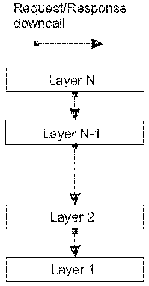
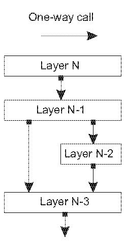
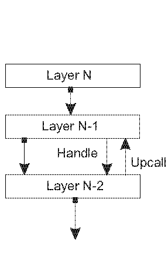
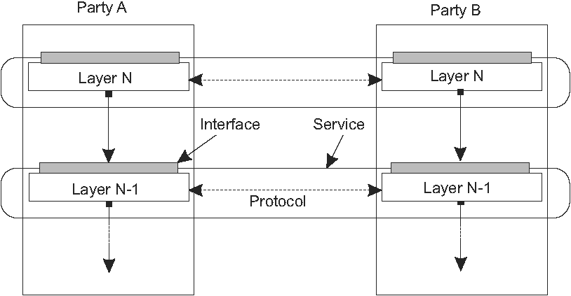
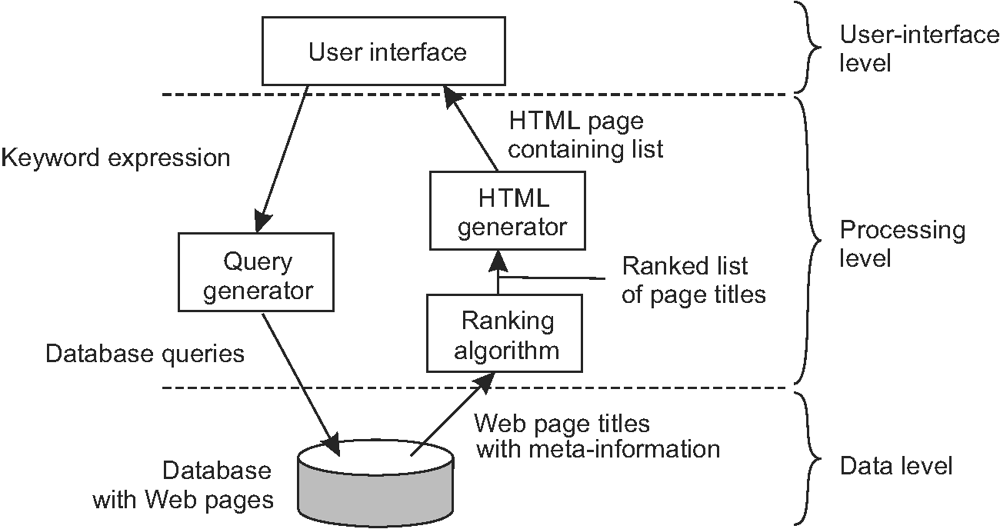

# アーキテクチャ
* 分散システムは，多くの場合，コンポーネントが複数のマシンに分散されている複雑なソフトウェアである．
  * 複雑さを習得するには，これらのシステムが適切に構成されている必要がある．
  * 分散システムの構成をみる方法は様々だが，明らかなのは，コンポーネントのコレクションの論理的構成と実際の物理的な実現を区別すること．
  * ここでのソフトウェアアーキテクチャは，様々なコンポーネントをどのように整理し，相互作用すべきかを教える．
* この章では，コンピュータシステムを構成（分散）するための幾つかの一般的に適用されているアーキテクチャスタイルに注目する．

 

* 分散システムの重要な目標は，ミドルウェア層を提供することで，アプリケーションを基盤とするプラットフォームから分離すること．
  * このような層は設計上の重要な決定であり，その主な目的は分散の透過性を提供することにある．
  * しかし，透過性を達成するためには，トレードオフを行う必要があり，アプリケーションのニーズに合わせてミドルウェアを調整する様々な手法がある．
  * より一般的に適用されるテクニックの幾つかについては，ミドルウェア自体の構成に影響を与えるため，これについて説明する．

 

* 分散システムの実際の実現には，ソフトウェアコンポーネントをインスタンス化して実際のマシンに配置する必要がある．これにより，さまざまな選択肢ができる．
  * ソフトウェアアーキテクチャの最終的なインスタンス化は，システムアーキテクチャとも呼ばれる．
  * この章では，単一のサーバーがほとんどのコンポーネントを実装し，リモートクライアントは単純な通信手段を使用してそのサーバーにアクセスできる従来の集中型アーキテクチャーを検討する．
  * さらに、すべてのノードがほぼ同等の役割を果たす分散型P2Pアーキテクチャを検討する．
  * 多くの分散システムは，ハイブリッドファッションで構成されており，集中型や非集中型の要素も組み合わさっている．
* 最後の章では，NFSファイル共有システムとWebの二つの広域分散システムについて考える．

 

## アーキテクチャスタイル
まず，分散システムの論理構成のソフトウェアコンポーネント（ソフトウェアアーキテクチャとも呼ばれる[Bass et al．，2003]）について，アーキテクチャに関する議論を始める．
* ソフトウェアアーキテクチャに関する研究はかなり成熟しており，大規模なシステムの開発には，アーキテクチャーの設計または採用が非常に重要であることは認められている．
* 私たちの議論では，アーキテクチャスタイルの概念が重要．
  * このようなスタイルは，コンポーネント，それが互いに接続される方法，交換されるデータ，およびこれらの要素がシステム内でどのように共同して構成されるかによって定式化される．
  * コンポーネントは，その環境内で交換可能な，明確に定義された必須インタフェースと提供されたインタフェースを持つモジュール単位となる[OMG，2004b]．
  * なぜなら，システムを止めることは許されず，一部だけが故障する可能性があるから．

 

* 把握するのが難しい概念は，コネクタのことであり，これは一般的にコンポーネント間の通信，協調，または協調を仲介するメカニズムとして説明されている[Mehta et al．Shaw and Clements，1997]．
  * 例えば，（遠隔の）プロシージャ呼び出し，メッセージパッシング，またはストリーミングデータのための機能によってコネクタを形成することができる．
* コンポーネントとコネクタを使用することで，さまざまな構成が可能になり，さまざまな構成がアーキテクチャスタイルに分類されます．
* 分散システムで重要なスタイルは以下である．
  1. 階層アーキテクチャ（Layered architectures）
  2. オブジェクトベースアーキテクチャ（Object-based architectures）
  3. リソース集中アーキテクチャ（Resource-centered architectures）
  4. イベントベースアーキテクチャ（Event-based architectures
）   
* 以下で個別に説明するが，ほとんどの分散システムは多くのスタイルが組み合わさっていることに注意が必要．
  * 特に階層化のアプローチは他のほとんどにも言える普遍的な原理である．

 

### 階層型アーキテクチャ（Layered architectures）
* 基本的な考えは簡単：
  * レイヤLjのコンポーネントは，下位レベルのレイヤLi（i<j）へのダウコールを行い，一般的なレスポンスが返答される．
  * 例外的な場合にのみ，より高いレベルのコンポーネントへのアップコールが行われる．三つの一般的なケースを図2.1に示す．

<table><tbody>
<tr>
  <td>  </td>
  <td>
   </td>
  <td>  </td>
</tr>
</tbody></table>

* 図2.1（a）は，下位層へのダウンコールのみが行われる標準的な構成を示す．この構成は，ネットワーク通信の場合に一般的に導入される．
* 図2.1（b）もよく遭遇する構成である．
  * 例えば，OSの機能のL-osを利用するアプリケーションAを考える．同時に，アプリケーションAはL-osを使用した数学ライブラリL-mathを使う．
  * この場合，図2.1（b）を参照すると，レイヤN-1がアプリケーションAの役割となり，レイヤN-2がL-math，レイヤN-3はL-osとなる．
* 図2.1（c）は特殊な例であり，下位のレベルからアップコールされる．
  * 例えば，OSがイベントの発生を通知して，アプリケーションが渡した操作（通常はハンドルと呼ばれる）を呼び出すイベントがある．

 

#### 階層化通信プロトコル

* よく知られた階層化アーキテクチャとして通信プロトコルがある．
  * ここでは，全体的な概要にのみ焦点を当て，詳細については4.1節で議論する．
* 通信プロトコルスタックでは，各レイヤは複数の通信サービスを実装し，宛先から一つまたは複数のターゲットにデータを送信できるようにする．
  * 各層は，呼び出すことができる機能を指定するためのインターフェースを提供する．
  * 原則として，インタフェースはサービスの実際の実装を隠すべき．
* 通信の場合のもう1つの重要な概念は，情報を交換するために従うべきルールを記述する（通信）プロトコルの概念である．
  * 提供されるサービスや，インターフェイス，通信などのプロトコルの違いを理解することは重要．
  * この違いを図2.2に示す．
 

* この違いを明確にするため，信頼性の高い接続指向のサービスを検討する．
  * この場合，通信相手との接続を確立してか二人がメッセージを送受信できるようにする必要があります．
  * 信頼できるということは，メッセージが失われる可能性が高い場合でも，送信されたメッセージが実際に相手側に配信されることが保証されることを意味する．
  * さらに，一般に，メッセージが送信された順序と同じ順序で配信されることを保証します．
* この種のサービスはTCP(Transmission Control Protocol)で実現されている．
  * このプロトコルでは，接続の設定や切断，転送されたデータの順序を保持するために必要な処理，送信中に失われたデータの検出と修正のために両者が行う必要があるメッセージを指定する．
  * このサービスは，比較的簡単なプログラミングインタフェースの形で利用可能になり，接続を設定したり，メッセージを送受信したり，接続を再度切断するための呼び出しが含まれる．
  * 実際には，利用可能なインタフェースが異なり，多くの場合，使用されるオペレーティングシステムやプログラミング言語に依存する．同様に，プロトコルおよびそのインタフェースの多くの異なる実装が存在する．

#### アプリケーションレイヤー
* アプリケーションの論理的な階層化に注目する
* 分散アプリケーションの目標として，データベースへのユーザーまたはアプリケーションのアクセスをサポートすることを考慮した場合，3つの論理レベルに区別できる．
  1. アプリケーションインターフェースレベル
  2. 処理レベル
  3. データレベル
* このレイヤーに沿って，アプリケーションはしばしば大きく3つの部分で構成される．
  1. ユーザーまたは一部の外部アプリケーションとのやりとりを処理する部分
  2. データベースまたはファイルシステムで動作する部分
  3. 一般にアプリケーションのコア機能を含む中間部分
* この中間部分は論理的に処理レベルに置かれる．
* ユーザーインターフェイスとデータベースとは対照的に，処理レベルに共通する側面は多くない．
  * 最初の例として，インターネット検索エンジンを考える．
    * ユーザはキーワードを入力し，続いてウェブページのタイトルのリストが提示される．
    * バックエンドは巨大なWebページ・データベースによって形成される．
    * 検索エンジンの核となるのは，ユーザーのキーワード列を1つ以上のデータベースクエリに変換するプログラム．
    * その後，結果をリストにランク付けし，HTMLページに変換する．
    * この情報検索部分は，通常，処理レベルに置かれる． 図2.4は，この構造を示しています．
 

  

* 二つ目の例は，株式仲介のための意思決定支援システムを考える．同様に，以下の3つのレイヤーに分けることができる．
  1. ユーザーインターフェイスを実装するフロントエンド，またはAPIを提供するフロントエンド．
  2. 財務データを持つデータベースにアクセスするためのバックエンド．
  3. これらの2つの間の分析プログラム．  

 

* データレベルには実際のデータを保持するプログラムが含まれている．
    * このレベルの重要な特性は，データが永続的であることが多いこと．
    * つまり，アプリケーションが実行されていなくても，データは次回の使用のためにどこかに保存される．
    * 最も単純な形式では，データ・レベルはファイル・システムで構成されるが，本格的なデータベースを使用することも一般的．
* データレベルは単にデータを格納するだけでなく，一般に，異なるアプリケーション間でデータの一貫性を維持する役割も果たす．
  * データベースが使用されている場合，一貫性を維持するということは，テーブル記述，入力制約，アプリケーション固有のメタデータなどもこのレベルに格納されることを意味する．
