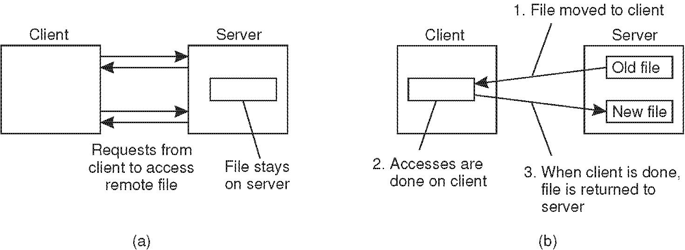
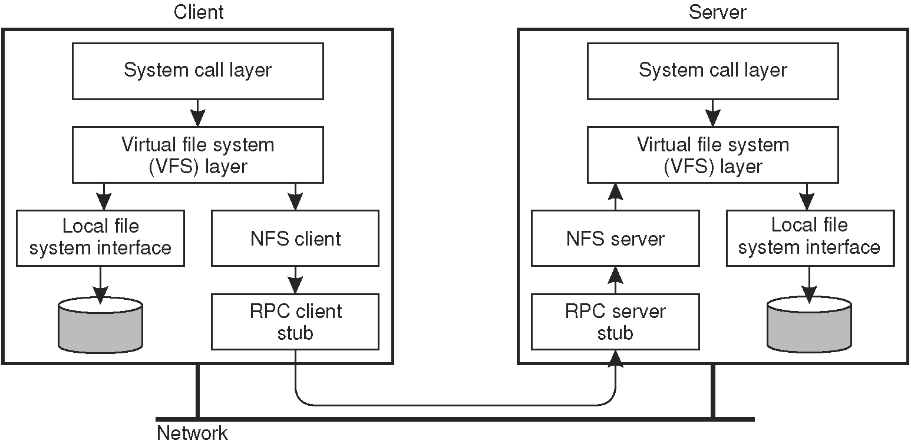
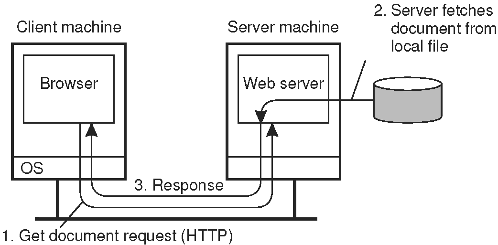
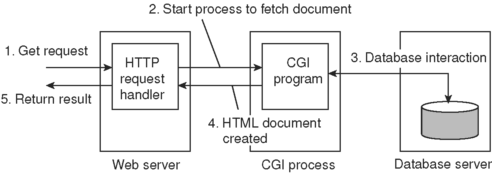

## アーキテクチャの例
### ネットワークファイルシステム
* 多くの分散ファイルシステムは，クライアント/サーバアーキテクチャに沿って編成されている
* Sun Microsystemのネットワークファイルシステム（NFS）はUnixシステムでもっとも広く使われている
* ここでは，広く使われるNFSv3と，最近のNFSv4の両方について議論する

* NFSの根本的な考えは，ローカルファイルシステムに見えるように提供することにある．
  * つまり，ファイルシステムをどうやって実装するかは問題ではなくて，ローカルファイルシステムと同じ使い方ができるようにすること．
  * これは，他の分散システムでも同じ．
* NFSは，クライアントがサーバーに格納されたファイルにアクセスできるようにする通信プロトコルが備わっているため，異なるOSやマシン上で実行される場合にもファイルシステムを共有できる．

**NFSのモデル**
* NFSや類似のシステムの基礎となるモデルは，リモートファイルサービスのモデルである．
  * このモデルでは，クライアントはリモートサーバーによって管理されるファイルシステムに透過的にアクセスできる．
  * だたし，クライアントはファイルの実際の場所を認識しない．
  * 代わりに，従来のローカルファイルシステムに似たインターフェースが提供される．
* クライアントにはファイル操作のインタフェースしか提供されず，サーバに具体的な操作を実装する．
  * このモデルを **remote access model** ともいう
  * これを図2.24(a)にあらわす．

* これに対して **upload/download model** を図2.24(b)に示す．
  * クライアントはサーバからダウンロードしたファイルをローカルでアクセスする．
  * クライアントがファイル操作を終了すると，サーバに再びアップロードされ，他のクライアントが使用できる．
    * この方法はFTPサービスのように，クライアントがファイルをダウンロードし，変更して元に戻す．

**NFSのアーキテクチャ**

* NFSは多くの異なったOSのために実装され，Unixのバージョンが主流となっている．
  * 多くのモダンなUnixシステムでは，NFSは図2.5のように多層アーキテクチャを使用して実装している．

* クライアントはローカルのOSが提供するシステムコールを使用してファイルシステムにアクセスする．
  * しかし，ローカルのUnixファイルシステムインタフェースは，異なるファイルシステムのための仮想ファイルシステム（VFS）へのインタフェースに置き換えられる[Kleiman,1986]．
  * 事実上，現代のすべてのOSはVFSを提供しており，開発者は，新しいファイルシステム構造を採用するときに，OSの巨大な部分を再実装することはない．
* NFSでは，VFSインタフェースの操作はローカルファイルシステムに渡されるか，またはリモートサーバに格納されたファイルへのアクセスを処理するNFSクライアントと呼ばれる別のコンポーネントに渡される．
  * NFSでは，すべてのクライアントとサーバー間の通信は，RPCを介して行われる．
  * RPCは本質的に，マシンAのクライアントが別のマシンBで実装されているプロシージャーへの通常の呼び出しを行う標準化された方法である．
  * RPCについては第4章で詳しく説明する．
  * NFSクライアントは，NFSファイルシステム操作をリモートプロシージャー呼び出しサーバーに送信する．
* VFSインタフェースが提供する操作は，NFSクライアントが提供する操作とは異なる可能性があることに注意が必要．
  * VFSの考え方は，さまざまなファイルシステムの違いを隠すことにある．

**NFSのサーバ側アーキテクチャ**
* サーバー側にも同様の組織がある．
  * NFSサーバーは，クライアント要求を処理する．
  * サーバーのRPCコンポーネントは，受信要求を通常のVFSファイル操作に変換し，その後VFSレイヤーに渡される．
* サーバ側でも，VFSは実際のファイルが格納されるローカルファイルシステムの実装を担当する．
* このスキームの重要な利点は，NFSがローカルファイルシステムからほとんど独立していること．
  * 原則として，クライアントまたはサーバのOSがUnixファイルシステム，Windowsファイルシステム，または古いMS-DOSファイルシステムを実装しているかどうかは実際問題ではない．
  * 唯一の重要な問題は，これらのファイルシステムがNFSによって提供されるファイルシステムモデルに準拠していること．
    * たとえば，短いファイル名のMS-DOSは，完全に透過的な方法でNFSサーバーを実装するために使用できない．

### The Web
* Webベースの分散システムのアーキテクチャは，基本的に他の分散システムとは異なる．
* しかし，分散ドキュメントをサポートするという最初の考え方が，1990年の開始以来どのように進化してきたのか興味深い．
  * 純粋に静的で積極的なコンテンツから，動的に生成されたコンテンツ．さらに，近年，多くの組織が単なる文書の代わりにサービスをサポートし始めている．

#### シンプルなWebベースシステム
* 多くのWebベースのシステムは，依然として比較的シンプルなクライアント/サーバーアーキテクチャとして編成される．
* Webサイトのコアは，ドキュメントを格納するローカルファイルシステムにアクセスできるプロセスによって形成される.
* ドキュメントを参照する最も簡単な方法は，URL（Uniform Resource Locator）を参照する方法がある．
  * 関連するサーバーのDNS名を，ローカルファイルシステムで文書を検索するためのファイル名とともに埋め込むことによって，文書の配置場所を指定する．
* クライアントは，文書を適切に表示するブラウザを介してWebサーバーと対話する．
* ブラウザはユーザに別のドキュメントへの参照を選択させることによって，次にそれを取り出して表示する．
* ブラウザとWebサーバー間の通信は標準化されている．
  * それらはどちらもHyperText Transfer Protocol（HTTP）に準拠している．
  * これは，図2.27に示す全体的な構成につながる．

**ブラウザとWebサーバの通信**
* おそらく最も単純な形式は標準的なテキストファイルである．
  * その場合，サーバーとブラウザーはほとんど何もする必要はない．
  * サーバーはローカルファイルシステムからファイルをコピーしてブラウザーに転送する．

**Web文書**
* 以下のように，より興味深いのはマークアップされたWeb文書のHTMLである．

`` <emph> Emphasize this text </emph> ``
* 文書にはマークアップの指示以上のものも含まれる．
  * 特に，以下のようなJavascriptがもっとも頻繁に導入されている．

`` 　``  

* スクリプトを含めることの主な利点は，サーバーに情報を送り返すことを含めて，エンドユーザーとの良い対話が可能になること．（後者は，フォームを通じてHTMLで常にサポートされている．）
* 具体的な話はここでは関係ないため，Webベースのアプリケーションを構築する方法については，[Sebesta，2006]を参照すること．

#### 多層アーキテクチャ
* Webは，図2.27に示す比較的シンプルな2層クライアント/サーバーシステムとして開始された．
* 今では，このシンプルなアーキテクチャはより洗練された手段をサポートするように拡張されている．
* 事実，「文書」という言葉はもはや適切ではないという正当な主張ができる．
  * 1つは，Webサーバーにリクエストを送信した結果，ブラウザで表示されるほとんどのものが現場で生成されていること．
    * コンテンツは，サーバー側のデータベースにクライアント側のスクリプトなどとともに保存され，ドキュメントにまとめられ，その後クライアントのブラウザに送信される．
    * したがって，ドキュメントは完全に動的である．
* 基本アーキテクチャの最初の拡張機能の1つは，Common Gateway InterfaceまたはCGIを使用した単純なユーザー対話のサポート．
* CGIは，Webサーバがユーザ・データを入力として受け取るプログラムを実行するための標準的な方法を定義する．
  * 通常，ユーザデータはHTMLフォームから取得する．
    * サーバ側で実行されるプログラムと，ユーザが入力するパラメータ値を指定する．
  * フォームが完了すると，図2.28に示すように，プログラムの名前と収集されたパラメータ値がサーバに送信される．

* サーバがリクエストを受けると，CGIプロセスにパラメータ値を渡す．
* その時点で，プログラムは単にその作業を行い，結果を一般にユーザのブラウザに戻って表示されるドキュメントの形で返す．
  * 図2.28に示すように，多くのプログラムはWebサーバのローカルデータベース上で動作する．
  * データを処理した後，プログラムはHTML文書を生成し，その文書をサーバに返す．
  * サーバーはその文書をクライアントに渡す．
* 興味深いのは，サーバは，CGIプログラムに対してドキュメントを取得するようにリクエストされているように見えるということ．
* 言い換えると，サーバは外部プログラムにドキュメントのフェッチを委任するだけ．

**今日のサーバはドキュメントを処理することもできる**
* サーバの主なタスクは，単にドキュメントを取得するだけでクライアント要求を処理することだった．
  * CGIプログラムでは，ドキュメントをその場で生成したのか，実際にローカルファイルシステムから読み込んだのかをサーバが認識しないように，ドキュメントの取得を委任することができる．
  * しかし，今日のサーバは，ドキュメントの取得だけではない．
* 最も重要な拡張機能の1つは，サーバーがドキュメントをクライアントに渡す前にドキュメントを処理できること．
* 特に，ドキュメントにはサーバサイドスクリプトが含まれていることがある．
  * このスクリプトは，ドキュメントがローカルにフェッチされたときにサーバによって実行される．
* スクリプトの実行結果は，残りの文書とともにクライアントに送信される．
  * スクリプト自体は送信されない．
  * つまり，サーバーサイドスクリプトを使用すると，基本的にスクリプトを実行結果に置き換えることによってドキュメントが変更される．
* 具体的に，ドキュメントを動的に生成する簡単な例を示す．
  * 次の内容が格納されたファイルを持ったサーバーがあるする．

`` <strong> <?php echo $_SERVER[’REMOTE_ADDR’]; ?> </strong> ``
* サーバーはファイルを調べ，その後，コードを要求元のクライアントのアドレスに置き換えて（ "<？php"と "？>"の間の）PHPコードを処理する．

## サマリー
* 分散システムは様々な方法で編成できる．
* ソフトウェアアーキテクチャとシステムアーキテクチャを区別することができる．
  * 後者は，分散システムを構成するコンポーネントが様々なマシンに配置される場所について考慮する．
  * 前者は，コンポーネントの相互作用，どのような方法で構造化できるのか，どのようにコンポーネントを独立させるかなど，ソフトウェアの論理的構成についてを考慮する．
* アーキテクチャについて語るときのキーワードは建築様式（アーキテクチャスタイル）である．
  * 建築様式は，分散システムを構成するソフトウェアコンポーネント間の相互作用を体系化する際に従う基本原則を反映している．
* 重要なスタイルには，レイヤー，オブジェクトベースのスタイル，リソースベースのスタイル，およびハンドリングイベントが含まれる．

**分散システムの構成**

**集中型アーキテクチャ**
* 分散システムには多くの異なる構成がある．
* 重要なクラスは，マシンがクライアントとサーバーに分割されるクラス．
  * クライアントはサーバーに要求を送信し，サーバーはクライアントに返す結果を生成する．
* クライアント/サーバーアーキテクチャは，モジュールを再利用可能にする方法を反映している．
* 異なるマシン上に異なるコンポーネントを配置することによって，機能を自然に分散することができる．
* クライアント/サーバアーキテクチャは，しばしば高度に集中化されている．

**非集中型アーキテクチャ**
* 分散アーキテクチャでは，P2Pシステムとも呼ばれる分散システムを構成するプロセスと同等の役割を果たすことがよくある．
* P2Pシステムでは，プロセスはオーバーレイネットワークに編成される．
  * オーバーレイネットワークは，すべてのプロセスが他のピアのリストを持つ論理ネットワークである．
    * オーバレイネットワークでは，プロセス間でメッセージをルーティングするための決定論的スキームを導入する．
* 構造化されていないネットワークでは，ピアのリストは多かれ少なかれランダムであり，データやその他のプロセスの検索に検索アルゴリズムが必要である．

**ハイブリッドアーキテクチャ**
* ハイブリッドアーキテクチャでは，集中化構成と非集中構成の要素が組み合わされている．
  * 例えば，クライアントをレプリカサーバにリダイレクトするなど，初期の要求を処理するために集中化コンポーネントが使用されることがある．
  * これは，BitTorrentベースのシステムの場合のように，P2Pネットワークの一部となる．
