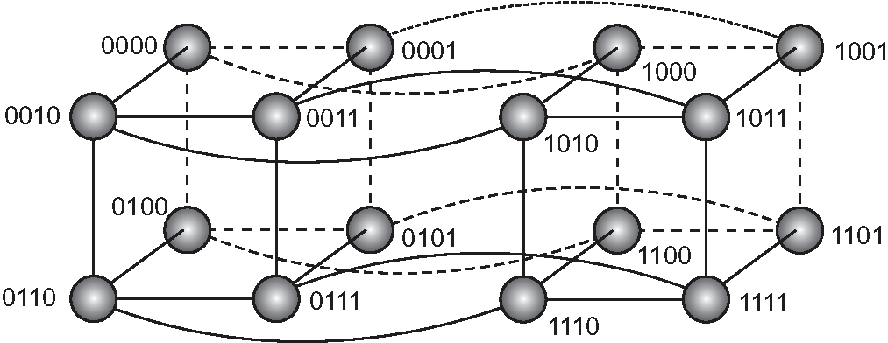
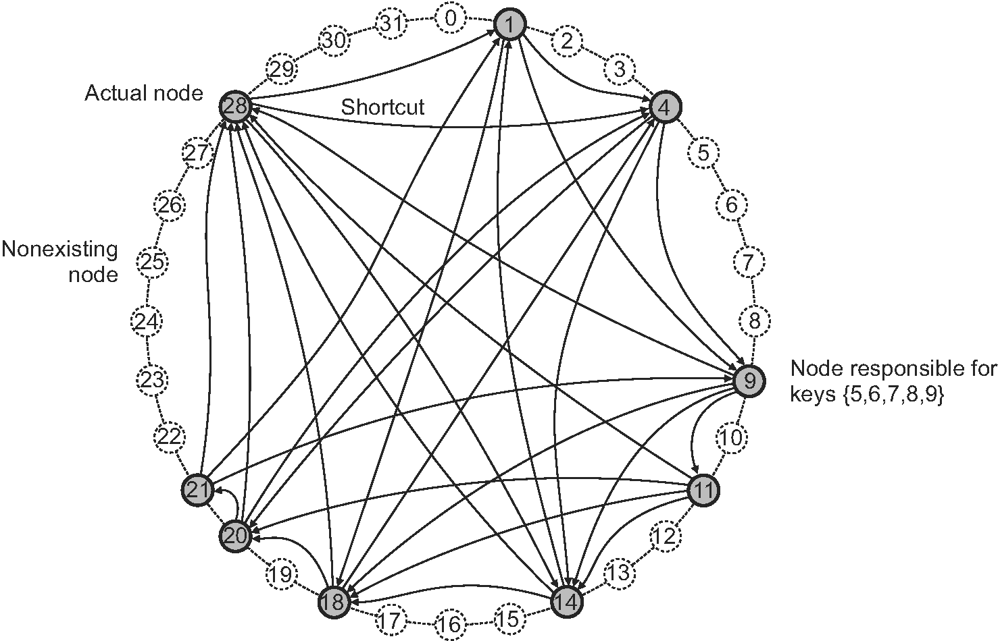

# 非集中型構成：P2Pシステム
### 分散システムの構成
* 分散アプリケーションにおける多層クライアント/サーバー・アーキテクチャの構成は以下からなる．
  1. ユーザー・インターフェース
  2. 処理コンポーネント
  3. データ管理コンポーネント
* 多くのビジネス環境での分散処理とは，この三層アーキテクチャをもとに構成されることが多い．

### 垂直分散
* 三層アーキテクチャなどに従って分散するタイプを垂直分散と呼ぶ．
    * 垂直分散の特徴は，異なるコンポーネントを異なるマシンに配置することによって達成される．

### 水平分散
* 現代のアーキテクチャでは，クライアントおよびサーバの分散が重要であり，水平分散と呼ぶ．
  * このタイプでは，クライアントやサーバーを物理的または論理的に同等の部分に分割し，各部分は完全なデータセットとして動作し，負荷を分散する．
* この章では，P2Pシステムと呼ばれる水平分散をサポートする最新のシステム・アーキテクチャのクラスを見る．

### P2Pの特徴
* P2Pシステムを構成するプロセスはすべて等しい．
  * つまり，実行に必要な機能は，分散システムを構成する全てのプロセスによって表される．
  * 結果として，プロセス間の相互作用の多くは対称的であり，各プロセスは同時にクライアントとサーバとして動作します（サーバントとも呼ばれる）
  * ノードは各プロセスによって表され，任意の他のノードと通信チャネルを介してメッセージを送信する必要がある．
* この対称的な振る舞いを考えると，P2Pアーキテクチャでは，このプロセスをどのようにオーバーレイネットワークとして構成するかという問題に発展する

### P2Pの参考文献
* オーバーレイネットワークには，構造化されたものとそうでないものがある．これらの2つのタイプは，Lua et al．[2005]にいくつか例がある．
  * Buford and Yu [2010]は，さらにさまざまなP2Pシステムの多くが含まれている．
  * Aberer et al [2005]は，異なる種類のP2Pシステムの比較について提供している．
  * Androutsellis-Theotokis and Spinellis [2004]は，コンテンツ配信の観点から行われた調査を提供している．
  * Buford et al． [2009]，Tarkoma [2010]とVu et al． [2010]は，研究のための適切なテキストブックを作成した．

<br>

## 構造型P2Pシステム
* 構造化P2Pシステムでは，リング，ツリー，グリッドなどの特定の決定論的トポロジに従ったオーバーレイによってノード(つまり，プロセス)が編成される．
  * オーバーレイは，データを効率的に検索するために使用する．
  * 構造化P2Pシステムの特徴は，システムによって保管される各データが一意なキーに関連付けられ，このキーがその後にインデックスとして使用される．
  * キーにはハッシュ関数を使用するのが一般的である．例えば次のようになる．
```
    key(data item) = hash(data item’s value).  
```


* 今では，P2Pシステム全体が（キー，バリュー）のペアを格納する役割を担っている．
  * 各ノードには，ハッシュ値から識別子が割り当てられ，キーに関連付けられたデータを格納する役割を担う．
  * システムはDHT [Balakrishnan et al．，2003]と略される分散ハッシュテーブルを実装する．
* このような，キーを使用してデータをLookupできるようになることが構造化されたP2Pシステムの本質だと言える．
* つまりシステムは，キーを既存のノードにマップするLookup関数の効率的な実装を提供することになる．
```
    existing node = lookup(key).
```
* 構造化P2Pではトポロジが重要な役割を果たす
  * 任意のノードは，キーをlookupするように要求され，キーに関連するデータを格納しているノードにたどり着くまで，その要求を効率的にルーティングする．


#### Lookupの例
* Lookupを明確にするために，超立方体に整理された固定数のノードを持つ簡単なP2Pシステムを考えてみる（図2.18）．
  * 超立方体はn次元の立方体であり，図2.18に示す超立方体は4次元である．
  * これは，2つの通常の立方体が相互に接続されているように考えることができる．
  
  * このシステムでは，各データは16のノードのいずれかに保管されている．
  * つまり，24個のデータに対してキー k∈{0，1，2 ，... ，24-1}とする．
  * 例として，識別子0111を有するノードが，バイナリ値1110に対応するキー14を有するデータをLookupするよう要求されたと仮定する．
  * Lookupの流れ
    * 0111は効率よくノードを探すために，ノード1110に近い近隣に要求を転送する．
    * この場合，これはノード0110またはノード1111のいずれかである．
    * ノード0110を選択すると，そのノードは，1110からデータを取り出すことができる．


# ノート2.5（Chordシステムの例）
* 前回（超立方体の例)までで説明したこと
  1. データを格納するノードを識別するためにハッシュ関数を使う
  2. データをLookupするときのP2Pシステムのトポロジに沿ったルーティングを行う
* しかし，現実的な例ではない
  * なぜなら，ノードの総数が固定されていると仮定したため．
  * したがって，実際に使用される構造化P2Pシステムの現実的な例を検討する



### Chordについて
* Chordシステム[Stoica et al．，2003]は論理的なリング状の構造を持つ．
  * これにより，ノードをmビット範囲にキーkをマッピングする．（mビットまでのid ≧ k）.
  * キーkが割り当てられているノードのことをSuccessorと呼び，succ(k)と表す．(キーの範囲は通常128から160ビット)


* 図2.19は小さなChordリングを表している．
  * キー7のSuccessorは9になり，同様にsucc(5)=9,succ(9)=9となる．
* Chordでは，ノードはショートカットを使う．
  * ショートカットは他のノードへのダイレクトな経路となる．（どのようにこのショートカットが構成されるのかについては，5章で説明する）．
  * この構造は，任意のノードまでの最短経路の長さがO（log N）であるように行われる(Nはノードの総数）．
  * キーをLookupするために，ノードは要求を「可能な限り」転送するように試みるが，そのキーを担当するノードを超えて渡すことはない．

### Chordの探索手順
* 説明するために，図のChordリングでは，ノード9はキー3を担当するノードをLookupするように求められているとする.
    * ノード9には，ノード11，14，18，および28の4つのショートカットがある．
      * ノード28は最も遠いキーを担当していて，キー3を超えていないため，Lookup要求に最もふさわしい．
    * ノード9はもっとも遠いノード28がキー3に一番近いと判断し，ノード28にLookup要求を渡す．
    * ノード28は3つのショートカットを持っている：1,4,14
      * （メモ）ノード28はノード1と4の間に何が存在するかしらない．
    * ノード28は，ノード1にリクエストを転送することがベストと判断してノード1に転送する．
    * そのあと，ノード1はリング内の次のノードがノード4であることを知っているため，これがキー3を担当するノードとなる．

### Chordの参加手順
  * 一意の識別子uを持つノードがChordオーバーレイに加わりたいとする．
    * 任意のノードに接続し，uをLookupするよう要求する．
    * つまり，v = succ（u）を返す．
  * その時点で，ノードuは，vとそのPredecessorの間にそれ自身を挿入するだけでよいので，vの新しいPredecessorになる．
  * また，この処理によって，他のノードへのショートカットも更新する（詳細は後の章で述べる）．
  * 離脱は単純．
    * ノードuはそのSuccessorとPredecessorに離脱を通知し，そのデータをsucc（u）に転送する．

## 非構造型P2Pシステム
* 構造化されたP2Pシステムは，特定の決定論的オーバーレイネットワークを維持しようとする．
* 対照的に，非構造型P2Pシステムでは，各ノードは隣接ノードの特別なリストを維持する．
  * 得られたオーバーレイは，ランダムグラフと呼ばれるものに似ている．
   [ランダムグラフ](https://image.slidesharecdn.com/complexnetworkchap4-120131100148-phpapp01/95/-8-728.jpg?cb=1328089252)
* このリストを使用して，より多くのピアを見つけたり，他のものを無視したりすることができる．（実際には，リストの更新も行う）．
  * 例えば，ノードは，近隣のノードの応答がないことで変更の必要に気づくことができる．
  * 他にも，このあと説明する．
* 構造化されたP2Pシステムとは異なり，近隣のリストが特殊な方法で構成されているため，データ探索は所定の経路に従うことができない．

<br>

* 2つの非構造型の例を見て，特定のデータを検索する場合を考える.


### Flooding
* フラッディングの場合，始点ノードuは，データ要求を全ての隣接ノードに単純に渡す．
* vは要求されたデータ項目をローカルで検索する．もしvが必要なデータを持っていれば，それは発行ノードuに直接応答するか，送信元に戻す.
* もしもvがデータを持っていなければ近隣のノードにリクエストを転送する．

### Floodingの問題
* フラッディングは非常にコストが高くなる可能性がある．
  * そのため，要求には生存時間またはTTL値が関連付けられていることが多く，要求の転送が許可される最大ホップ数が与えられる．
* 適切なTTL値を選択することは非常に重要．
  * 小さすぎるとデータを持つノードに到達しない可能性がああり，大きすぎると通信コストが高くなる．
* TTL値を設定する代わりに，ノードは最初のTTL値が1である検索を開始することもできる．
  * つまり，最初に隣接ノードのみを照会する．
  * 失敗した場合，TTLを増加して新しい検索が開始される．

<br>

### Random walks
* 他の探索スペクトルとして，発行ノードuはランダムに選択された隣人，例えばvを求めることによってデータ項目を見つけることができる．
  * vがデータを持たない場合は，ランダムに選択されたノードに要求を転送する．
  * これをランダムウォークという[Gkantsidis et al., 2006; Lv et al., 2002].
* ランダムウォークはトラフィックを大幅に少なくするが，データを持つノードに到達するまでにはかなりの時間がかかることがある．
* 時間を短縮するために，ランダムウォークを同時に実行することも可能
* ランダムウォークも要求の最大(TTLなど)を決める必要がある．
  * この場合，TTLを再度使用するか，または送信元に，別のランダムに選択された隣接ノードへの要求を転送するようにする．

### FloodingとRandom walksの特徴
* どちらの方法も，要求したデータが見つかったかの判定に，特定の比較手法を使用していないことに注意．
  * 構造化P2Pシステムでは，比較のためにキーの使用を前提としていた．
  * 今説明した2つのアプローチでは，どのような比較手法でも問題ない．
* フラッディングとランダムウォークには，ポリシーベースの検索方法がある．
  * 例えば，ノードは積極的に応答したピアを追跡し，次のクエリの優先隣接ノードに反映することができる.

<br>

## 階層型構造P2Pネットワーク
* 非構造化P2Pシステムでは，データの場所を特定することは，ネットワークが拡大するにつれて問題となり得る．
  *  このスケーラビリティ問題の理由は簡単
    * Lookup要求のルーティングに対する決定的な方法がなく，唯一の方法として，FloodingまたはRandom walksによって要求を検索するため．
* P2Pでも対称性を持たない場合がある
  * 例）CDNはドキュメントを保存することで，迅速にページにアクセスできる．
  * 重要なのはどこにドキュメントを保存するかの方法
    * この場合，近接ノードのリソース容量と，可用性に関するデータを管理するブローカーを使用することで素早くノードを選択することができる．

### スーパーピア
* 牽引やブローカーとして機能するノードのことをスーパーピアと呼ぶ
 * スーバーピアはP2Pネットワークで構成されることも多く，階層構造になっている．（図2.20に例を示す）
 * 弱いピアはスーパーピアに接続されて，全ての通信はスーパーピアを介して行われる．
 * 多くの場合，弱いピアとスーバーピアとの接続は固定されている
  * 弱いピアは参加してから離脱するまでスーバーピアに接続しつづける．
 * スーパーピアは高可用性なプロセスであることが求められる．
  * スーバーピアどうしをペアにして，弱いピアを両方に接続させるなどのバックアップ方式を導入することもできる．

### スーパーピアの問題
* スーパーピアとの固定された接続はベストとはいえない．
  * 例えば，ファイル共有ネットワークの場合，弱いピアは欲しいファイルを持ったスーパーピアに接続する方がいいかもしれない．
  * 特に，LookUpの結果を返すスーパーピアの方が他より優先される
* P2Pネットワークは柔軟な参加や離脱を提供するが，スーパーピアネットワークでは，スーパーピアになれるノードを選択する方法が導入される．
  * この問題は，6.4節で議論するリーダー選挙問題と密接に関わる


# Note2.7（例：Skypeネットワーク）
* 階層構造型P2Pネットワークの最も成功した例として，Skype VOIPネットワークをみる．
  * Skypeの仕組みの公式な出版物はないが，BasetとSchulzrinne [2006]が分析している．
* Skypeは，図2.20に示すように構成されている．
  * 重要な違いとして，全てのピアが通信できる集中型Skypeログインサーバが存在する．（つまり，システム全体の作業にはスーパーピアが必要となる）．
  * ログインサーバに加えて，弱いピアが接続を開始するためのデフォルトのSkypeスーパーピアがある．
    * これらのスーパーピアのアドレスはソフト内にハードコードされている．
  * それぞれの弱いピアには，ホストキャッシュと呼ばれる，到達可能なスーパーピアのアドレスリストがある．
    * スーパーピアへの接続が失敗すると，デフォルトのスーパーピアに接続しようとする．
* Skyepネットワークに接続するためには，弱いピアはスーパーピアに接続する必要がある．
  * 特に，NATed（ファアフォールの内側）にある場合，スーパーピアが接続の際に役立つため重要となる．

### 通話の例
* 最初に，ピアAがピアB（弱いピア）に連絡したいという状況を考える．
  * この時，NATedかどうかによって，3つのケースを区別する必要がある．

#### AとBの両方がパブリックなインターネットにある場合：
* パブリックにいるということは，AとBは直接通信できることを意味する．
  * この場合，制御パケットを交換するために使用されるAとBとの間にTCP接続が設定される。 実際の呼び出しは、呼び出し元と呼び出し先でそれぞれネゴシエートされたポート間でUDPパケットを使用して行われます。

#### Aはファイアウォール内で動作し，Bはパブリックインターネット上にある：
* AはスーパーピアSへのTCP接続をセットアップし，その後SはBへのTCP接続をセットアップする．
* TCP接続はSを介したAとB間で制御パケットを送信する．
* 実際の通話はUDPを使用して直接AとBの間で行われる
  * しかし，SはUDPパケット交換を可能にするために，Aのファイアウォールのポート番号の正しいペアを見つける必要がある．

#### AとBの両方がファイアウォールの内側で動作する場合：
* ファイアウォールがUDPを制限している場合は，もっとも難しい．
* AはTCPを介してスーパーピアSに接続する．
* その後，SはBへのTCP接続を確立することで，制御パケットを交換する．
* 実際の通話は，リレーRの役割をはたす別のスーパーピアに接続する．
* AはRへの接続を設定し，Bも設定する．
* その後，全ての音声トラフィックは二つのTCP接続を介して転送される．

* ユーザはどうやってお互いを見つけるのか？
  * 前述のように，弱いピアはスーパーピアとのTCP接続を行う．
  * スーパーピアは，ローカルのキャッシュにあるか，デフォルトのスーパーピアの一つを介して取得する．
  * 検索は，スーパーピアから他のピアのリストをもらう．
  * 見つからない場合は，転送するための別の検索先のスーパーピアのリストを返す．
  * これを見つかるまで繰り返す．
* 接続では，検索先のユーザがオンラインの場合にのみVOIP接続が可能になる．
* 最後に，Skypeログインサーバーを使用して，登録ユーザーだけがネットワークを利用できるようにする．

## ハイブリッドアーキテクチャ
* これまで，クライアント・サーバアーキテクチャと，P2Pアーキテクチャに注目してきた．
  * しかし，多くの分散システムでは，スーパーピア・ネットワークで既にあったように，アーキテクチャを組み合わせている．
* この節では，クライアントサーバと分散アーキテクチャを組み合わせたシステムについて見ていく．

### エッジサーバシステム
* これらのシステムではサーバがネットワークの「エッジ（端）」に配置されているインターネット上に展開される．
* このエッジは，例えばISPによって提供されるように，企業ネットワークと実際のインターネットとの間の境界によって形成される．
* 同様に，自宅のエンドユーザがISPを介してインターネットに接続する場合，ISPはインターネットの端に存在するとみなすことができる．これは、図2.21に示すような一般的な組織につながります．
* エンドユーザー，つまり一般的なクライアントはエッジサーバを使用してインターネットに接続する．
* エッジサーバの主な目的はフィルタリング機能と，
