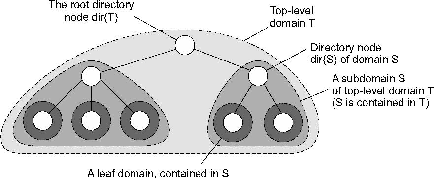
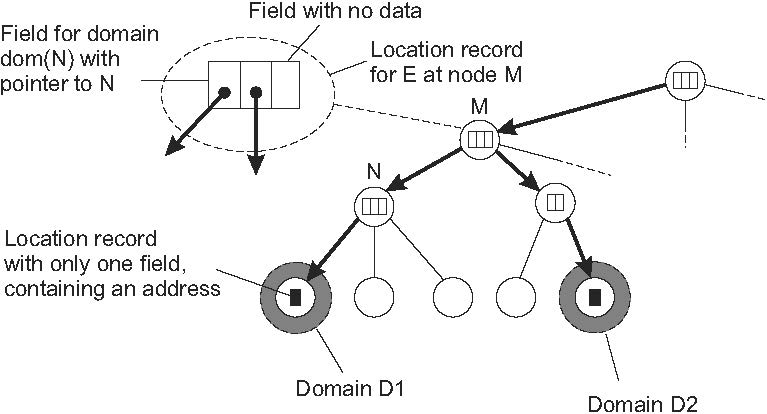
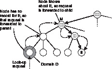
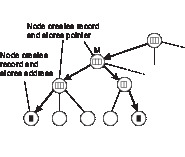

**分散ハッシュテーブル**
* Chordの話
* 省略

**階層型アプローチ**
* 階層型アプローチの例としてGlobe location serviceについて説明する [van Steen et al., 1998]．
* 階層スキームでは，ネットワークはドメインの集合に分割される．
  * ネットワーク全体にまたがる単一のトップレベルドメインが存在する．
  * 各ドメインは複数の小さなサブドメインに細分することができます．
* リーフドメインと呼ばれる最低レベルのドメインは，コンピュータネットワーク内のLANまたは携帯電話ネットワーク内のセルに対応する．
* 一般的な前提
  * あるドメインから別のドメインにメッセージを転送するのに要する平均時間は，ドメインが大きいよりも小さい方が早い
* 各ドメインDは，そのドメイン内のエンティティを追跡する関連ディレクトリノードdir（D）を有する．
  * ディレクトリノードのツリーと関連する．
  *  ルート（ディレクトリ）ノードと呼ばれるトップレベルドメインのディレクトリノードは，すべてのエンティティについて知っている（図5.6）．

* エンティティの所在を追跡するために，現在のドメインDに位置する各エンティティは，ディレクトリノードdir（D）内のロケーションレコードによって表される．
* リーフドメインDのディレクトリノードN内のエンティティEの位置記録は，そのドメイン内のエンティティの現在のアドレスを含む．
* 対照的に，Dを含む次のより高いレベルのドメインD 'のためのディレクトリノードN'は、Nへのポインタのみを含むEのための位置記録を有する．
* 同様に、N 'の親ノードは、E N 'へのポインタのみを含む．
* 結果として、ルートノードは各エンティティのロケーションレコードを持ち、各ロケーションレコードは、そのレコードの関連エンティティが現在位置している次の下位レベルのサブドメインのディレクトリノードへのポインタを格納する．

#### ツリーの構成
* エンティティは，複製されている場合などに複数のアドレスを持つことができる．
* エンティティがリーフドメインD1とD2にそれぞれアドレスを持つ場合
  * D1とD2の両方を含む最小のドメインのディレクトリノードは，アドレスを含む各サブドメインに1つずつ，2つのポインタを持つ．
  * 図5.7に示すようなツリーの一般的な構成につながる．

#### ルックアップ手順
* 階層的なロケーションサービスでルックアップ操作がどのように進行するか考える．
* 図5.8に示すように，クライアントがエンティティE（右下のノード）を探したい場合，クライアントが所属するリーフドメインDのディレクトリノードにルックアップ要求を発行する．
  * ディレクトリノードがエンティティの位置記録を格納していない場合，エンティティは現在Dに位置していない．
  * 結果，ノードは要求をその親に転送する．
  * 親にもEのロケーションレコードがない場合，ルックアップ要求は次のレベルに転送され以下同様に続く．

* 要求がディレクトリノードMに達すると，EはノードMによって表されるドメインdom（M）のどこかにあることがわかる．
* 図5.8を見ると，Mはそのサブドメインの1つへのポインタを含むロケーションレコードを格納するように示されている．
* ルックアップ要求は，そのサブドメインのディレクトリノードに転送され，そのサブドメインは，要求が最終的にリーフノードに到達するまでツリーのさらに下に転送する．
* リーフノードに格納されたロケーションレコードは，そのリーフドメインにEのアドレスを含む．
* 見つかったアドレスは，最初にルックアップを要求したクライアントに返すことができる．

#### 階層型ロケーションの重要ポイント
* 階層的ロケーションサービスに関する重要な点は，ルックアップ操作が局所性を利用することである．
* 原則としてエンティティは，要求元のクライアントを中心とした徐々に増加するリング内で検索される．
* 探索領域は，ルックアップ要求が次のより高いレベルのディレクトリノードに転送されるたびに展開される．
* 最悪の場合，要求はルートノードに到達するまで続く．
  * ルートノードは各エンティティの位置記録を有するため，リクエストはリーフノードの1つへのポインタの下向き経路に沿って単純に転送される．

#### 更新操作
* 更新操作は，図5.9に示すように同様の方法で局所性を利用する．
* エンティティEのレプリカをリーフドメインD内のアドレスに挿入する場合を考える．

  
    1. 挿入はDのリーフノードdir（D）で開始され，Dはその挿入要求をその親に転送する．
    2. 親はすでにEの位置記録を格納しているディレクトリノードMに到達するまで挿入要求を転送する．

  
    3. ノードMは挿入要求が転送された子ノードを参照してEの位置記録のポインタを格納する．
    4. Mの子ノードはEのロケーション記録を作成し，下位レベルノードへのポインタを含む．
    5. このプロセスは，挿入が開始されたリーフノードに到達するまで続く．
* リーフノードは，最後に関連付けられたリーフドメイン内のエンティティのアドレスを持つレコードを作成する．

#### ポインタのチェーンは下から上に構築される
* 上記のようにアドレスを挿入すると，エンティティEのロケーションレコードを持つ最下位レベルのディレクトリノードから開始して，ポインタのチェーンをトップダウン形式でインストールすることになる．
* 階層型の利点はアドレスができるだけ早くルックアップに利用できるようになることにある．
* アドレスの検索の際に，親ノードに一時的に到達できない場合にも現在のノードによって表されるドメイン内で引き続き検索することができる．

## 5.3 構造型ネーミング
* フラットな名前はマシンには良いが，一般的に人間にとって使いやすいものではない．
* 代わりに，ネーミング・システムは，一般に人間が読める単純な名前から構成された構造化された名前をサポートする．
* ファイルの命名だけでなく，インターネット上のホスト命名もこのアプローチに従う．
* このセクションでは構造化された名前と，これらの名前がアドレスに解決される方法に焦点を当てる．
