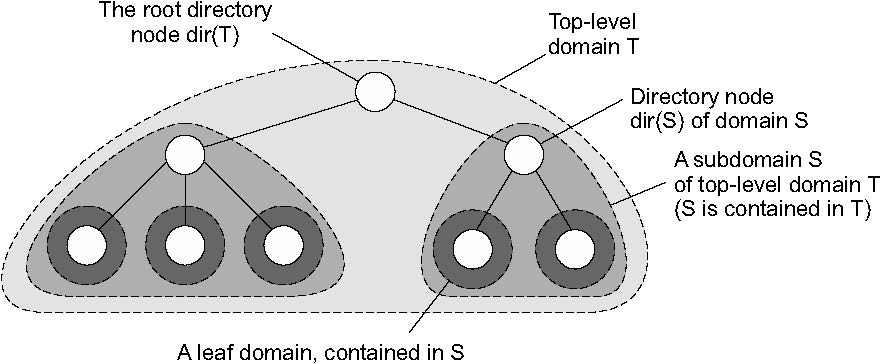
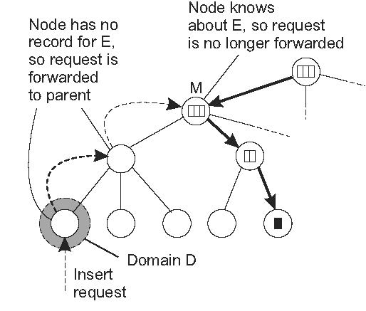
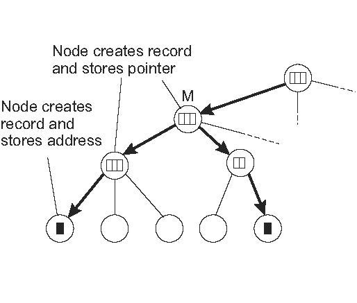

## 分散ハッシュテーブル
* Chordの話
* 省略

## 階層型アプローチ
* 階層スキームでは，ネットワークはドメインの集合に分割される．
  * ネットワーク全体にまたがる単一のトップレベルドメインが存在する．
  * 各ドメインは複数の小さなサブドメインに細分することができます．
* リーフドメインと呼ばれる最低レベルのドメインは，コンピュータネットワーク内のLANまたは携帯電話ネットワーク内のセルに対応する．
* 一般的な前提
  * あるドメインから別のドメインにメッセージを転送するのに要する平均時間は，ドメインが近い方が早い
* 各ドメインをDとすると，そのドメイン内のエンティティを追跡するため，関連ディレクトリノードdir（D）を有する
  * ディレクトリノードのツリーと同じ
  *  ルート（ディレクトリ）ノードと呼ばれるトップレベルドメインのディレクトリノードは，すべてのエンティティについて知っている（図5.6）

**階層構造の説明（難しいわりに重要な話ではない）**
* エンティティの所在を追跡するために，現在のドメインDに位置する各エンティティは，ディレクトリノードdir（D）内のロケーションレコードによって表される
* リーフドメインDのディレクトリノードN内のエンティティEの位置記録は，そのドメイン内のエンティティの現在のアドレスを含む
* 対照的に，Dを含む次のより高いレベルのドメインD 'のためのディレクトリノードN'は，Nへのポインタのみを含むEのための位置記録を有する
* 同様に，N 'の親ノードは，E N 'へのポインタのみを含む
* 結果として，ルートノードは各エンティティのロケーションレコードを持ち，各ロケーションレコードは，そのレコードの関連エンティティが現在位置している次の下位レベルのサブドメインのディレクトリノードへのポインタを格納する

**ツリーの構成**
* エンティティは，複製されている場合などに複数のアドレスを持つことができる．
* エンティティがリーフドメインD1とD2にそれぞれアドレスを持つ場合
  * D1とD2の両方を含む最小のドメインのディレクトリノードは，アドレスを含む各サブドメインに1つずつ，2つのポインタを持つ．
  * 図5.7に示すようなツリーの一般的な構成につながる．

**ルックアップ手順**
* 階層的なロケーションサービスでルックアップ操作がどのように進行するか考える．
* 図5.8に示すように，クライアントがエンティティE（右下の黒い四角のノード）を探したい場合，クライアントが所属するリーフドメインD（左下）のディレクトリノードにルックアップ要求を発行する．
  * ディレクトリノードがエンティティの位置記録を格納していない場合，エンティティは現在Dに位置していない．
  * 結果，ノードは要求をその親に転送する．
  * 親にもEのロケーションレコードがない場合，ルックアップ要求は次のレベルに転送され以下同様に続く．

* 要求がディレクトリノードMに達すると，EはノードMによって表されるドメインdom（M）のどこかにあることがわかる．
* 図5.8を見ると，Mはそのサブドメインの1つへのポインタを含むロケーションレコードを格納するように示されている．
* ルックアップ要求は，そのサブドメインのディレクトリノードに転送され，そのサブドメインは，要求が最終的にリーフノードに到達するまでツリーのさらに下に転送する．
* リーフノードに格納されたロケーションレコードは，そのリーフドメインにEのアドレスを含む．
* 見つかったアドレスは，最初にルックアップを要求したクライアントに返すことができる．

**階層型ロケーションの重要ポイント**
* 階層的ロケーションサービスに関する重要な点は，ルックアップ操作が局所性を利用することである．
* 原則としてエンティティは，要求元のクライアントを中心とした徐々に増加するリング内で検索される．
* 探索領域は，ルックアップ要求が次のより高いレベルのディレクトリノードに転送されるたびに展開される．
* 最悪の場合，要求はルートノードに到達するまで続く．
  * ルートノードは各エンティティの位置記録を有するため，リクエストはリーフノードの1つへのポインタの下向き経路に沿って単純に転送される．

**更新操作**
* 更新操作は，図5.9に示すように同様の方法で局所性を利用する．
* エンティティEのレプリカをリーフドメインD内のアドレスに挿入する場合を考える．

    1. 挿入はDのリーフノードdir（D）で開始され，Dはその挿入要求をその親に転送する．
    2. 親はすでにEの位置記録を格納しているディレクトリノードMに到達するまで挿入要求を転送する．

  

    3. ノードMは挿入要求が転送された子ノードを参照してEの位置記録のポインタを格納する．
    4. Mの子ノードはEのロケーション記録を作成し，下位レベルノードへのポインタを含む．
    5. このプロセスは，挿入が開始されたリーフノードに到達するまで続く．

  

    6. リーフノードは，最後に関連付けられたリーフドメイン内のエンティティのアドレスを持つレコードを作成する．

**ポインタのチェーンはトップダウン形式でインストールされる**
* 上記のようにアドレスを挿入すると，エンティティEのロケーションレコードを持つ最下位レベルのディレクトリノードから開始して，ポインタのチェーンをトップダウン形式でインストールすることになる．
* 階層型の利点はアドレスができるだけ早くルックアップに利用できるようになることにある．
* アドレスの検索の際に，親ノードに一時的に到達できない場合にも現在のノードによって表されるドメイン内で引き続き検索することができる．

----

# 5.3 構造型ネーミング
* フラットな名前はマシンには良いが，一般的に人間にとって使いやすいものではない．
* 代わりに，ネーミング・システムは，一般に人間が読める単純な名前から構成された構造化された名前をサポートする．
* ファイルの命名だけでなく，インターネット上のホスト命名もこのアプローチに従う．
* このセクションでは構造化された名前と，これらの名前がアドレスに解決される方法に焦点を当てる．

## 名前空間
* 名前は，一般に名前空間と呼ばれるもので編成される．
* 構造化された名前の名前空間は，2種類のノードを持つ有向グラフとして表すことができる．

**リーフノード**
* リーフノードは名前付きエンティティを表し，出力エッジを持たない特性を持つ
  * リーフノードは，クライアントがアクセスできるようにエンティティに関する情報（例えばアドレス）を格納する
  * あるいは，リーフノードがファイルを含むことを表現するようなファイルシステムの場合など，エンティティの状態を格納することもできる

**ディレクトリノード**
* リーフノードとは対照的に，ディレクトリノードには図5.11に示すように，名前を付けられた多数の発信エッジがある．
* ネーミンググラフの各ノードは，分散システム内のさらに別のエンティティとみなされる．
* ディレクトリノードは関連する識別子を持ち，出力エッジについてペア（ノード識別子，エッジラベル）として表現したテーブルを格納する
* このようなテーブルをディレクトリテーブルといいます。

* 図5.11に示すネーミンググラフには，発信エッジと受信エッジを持たないノードn0がある
  * 命名グラフのルート（ノード）と呼ばれる
  * ルートノードは複数存在する可能性があるが，簡単にするために1つしかないとする
* 命名グラフの各パスは，そのパスのエッジに対応するラベルのシーケンスによって参照できる
  *  例：N：[label1，label2，...，labeln]など（Nはパスの最初のノードを示す）
* このシーケンスをパス名と呼ぶ
  * パス名の最初のノードが命名グラフのルートである場合，絶対パス名と呼ばれる
  * それ以外を相対パス名と呼ぶ
* 名前は常に名前空間に編成されていることを認識することが重要
  * 結果として名前は常にディレクトリノードに対してのみ定義される
  * この意味で「絶対的な名前」という用語は多少誤解を招く
* グローバル名とローカル名の違い
  * グローバル名：その名前がシステムでどこで使用されていても同じエンティティを示す
    * 言い換えると，グローバル名は常に同じディレクトリノードに解釈される
  * ローカル名：その解釈がその名前がどこで使用されているかに依存する名前
    * 言い換えると，ローカル名は本質的にそれが含まれるディレクトリが（暗黙的に）知られている相対名である

* この命名グラフは多くのファイルシステムに実装されているものに近い．
  * ただし，パス名を表すのにシーケンスを書き込む代わりに，ファイルシステム内のパス名はラベルがスラッシュ（"/"）などの区切り文字で区切られた単一の文字列として表す
  * この文字は，パス名が絶対パスかどうかを示すためにも使用される．
    * 例）図5.11では，n0：[home，steen，mbox]
    * つまり，実際のパス名を使用する代わりに，文字列/home/steen/mboxを使用する
* 同じノードにつながるパスが複数ある場合，そのノードを異なるパス名で表すことができる
  * 例）図5.11のノードn5は/home/steen/keysと /keysで参照できる
* パス名の文字列表現は，ファイルシステムだけに使用されるグラフ以外のネーミンググラフにも同様に適用できる
  * Plan 9 [Pike et al．，1995]では，プロセス，ホスト，I/Oデバイス，ネットワークインターフェイスなどのすべてのリソースは，従来のファイルと同じ方法で命名されている．
  * このアプローチは，分散システム内のすべてのリソースに対して単一のネーミンググラフを実装するのと同様
