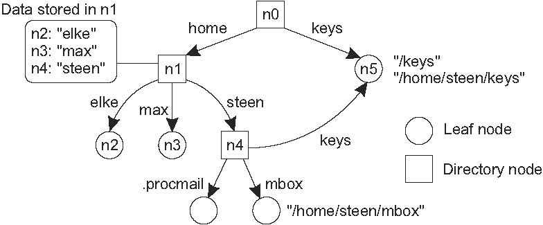

# 5.3 構造型ネーミング
* フラットな名前はマシンには良いが，一般的に人間にとって使いやすいものではない．
* 代わりにネーミングシステムは，人間が読める単純な名前から構成された構造化された名前をサポートする
* ファイルの命名だけでなく，インターネット上のホスト命名もこのアプローチに従う．
* このセクションでは構造化された名前と，これらの名前がアドレスに解決される方法に焦点を当てる

## 名前空間
* 名前は，一般に名前空間と呼ばれるもので編成される
* 構造化された名前の名前空間は，2種類のノードを持つ有向グラフとして表すことができる

**リーフノード**
* リーフノードは名前付きエンティティを表し，出力エッジを持たない特性を持つ
  * リーフノードは，クライアントがアクセスできるようにエンティティに関する情報（例えばアドレス）を格納する
  * あるいは，リーフノードがファイルを含むことを表現するようなファイルシステムの場合など，エンティティの状態を格納することもできる

**ディレクトリノード**
* リーフノードとは対照的に，ディレクトリノードには図5.11に示すように，多数の出力エッジがある．
* ネーミンググラフの各ノードは，分散システム内のさらに別のエンティティとみなされる．
* ディレクトリノードは関連する識別子を持ち，出力エッジについてペア（ノード識別子，エッジラベル）として表現したテーブルを格納する
  * このようなテーブルをディレクトリテーブルという

* 図5.11に示すネーミンググラフには，出力エッジと入力エッジを持たないノードn0がある
  * 命名グラフのルート（ノード）と呼ばれる
  * ルートノードは複数存在する可能性があるが，簡単にするために1つしかないとする
* 命名グラフの各パスは，そのパスのエッジに対応するラベルのシーケンスによって参照できる
  *  例：N：[label1，label2，...，labeln]など（Nはパスの最初のノードを示す）
* このシーケンスをパス名と呼ぶ
  * パス名の最初のノードが命名グラフのルートである場合，絶対パス名と呼ばれる
  * それ以外を相対パス名と呼ぶ
* エンティティの名前は常に名前空間に編成されていることを認識することが重要
  * 結果として名前は常にディレクトリノードに対してのみ定義される
  * この意味で「絶対的な名前」という用語は多少誤解を招く
* グローバル名とローカル名の違い
  * グローバル名：その名前がシステムでどこで使用されていても同じエンティティを示す
    * 言い換えると，グローバル名は常に同じディレクトリノードに解釈される
  * ローカル名：その解釈がその名前がどこで使用されているかに依存する名前
    * 言い換えると，ローカル名は本質的にそれが含まれるディレクトリが（暗黙的に）知られている相対名である

**ディレクトリパス**
* この命名グラフは多くのファイルシステムに実装されているものに近い．
  * ただし，パス名を表すのにシーケンスを書き込む代わりに，ファイルシステム内のパス名はラベルがスラッシュ（"/"）などの区切り文字で区切られた単一の文字列として表す
  * この文字は，パス名が絶対パスかどうかを示すためにも使用される．
    * 例）図5.11では，n0：[home，steen，mbox]
    * つまり，実際のパス名を使用する代わりに，文字列/home/steen/mboxを使用する
* 同じノードにつながるパスが複数ある場合，そのノードを異なるパス名で表すことができる
  * 例）図5.11のノードn5は/home/steen/keysと /keysで参照できる
* パス名の文字列表現は，ファイルシステムだけに使用されるグラフ以外のネーミンググラフにも同様に適用できる
  * Plan 9 [Pike et al．，1995]では，プロセス，ホスト，I/Oデバイス，ネットワークインターフェイスなどのすべてのリソースは，従来のファイルと同じ方法で命名されている．
  * このアプローチは，分散システム内のすべてのリソースに対して単一のネーミンググラフを実装するのと同様

* 前述したように，ほとんどの名前空間にはルートノードが1つしかない．
  * 名前空間は階層的であり，ネーミンググラフはツリーとして編成される
    * つまり，ルートを除く各ノードは1つの入力エッジを持つ
  * ルートにはエッジがない
    * つまり，各ノードには1つの関連（絶対）パス名が存在する
  * 図5.11に示す命名グラフは，有向非循環グラフの例
    * このような構造では，ノードは複数の入力エッジを持つことができるが，グラフにはサイクルがあることは許されない
    * この制限がない名前空間もある

## Note 5.7 (More information: Implementing the Unix naming graph)
