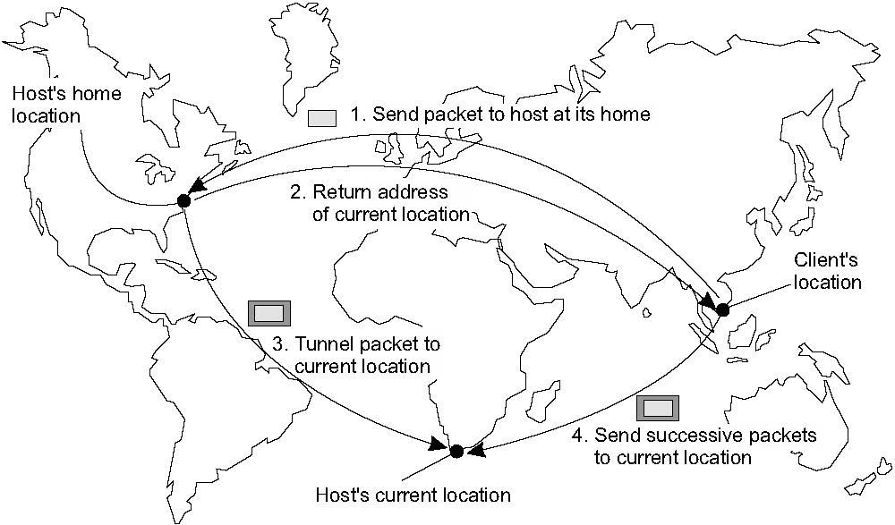

# 5　ネーミング

**はじめに**
* ネーミングはコンピュータシステムにおいて重要な役割を担っている．
  * 資源の共有，一意な識別，位置など様々
* ネーミングの重要な役割は参照するエンティティに対して名前が解決できること
* 名前解決にはネーミングシステムが必要
  * 分散システムと非分散システムとの違いはネーミングシステムを実装している点にある
* 分散システムではネーミングシステムを実装すること自体が複数のマシンに渡って分散されることもよくある
  * この分散がどのように行われるかが，ネーミングシステムの効率性やスケーラビリティのための重要な役割になります．

**フラットネーミングシステム**
* はじめに，フラットネーミングシステムとよばれるものについて考える
* このようなシステムでは，エンティティは意味を持たない識別子によって参照される（key-value）
* さらにフラットな名前は構造を持たずに，エンティティの位置を探すための特別なメカニズムが必要．
  * フォワーディングリングのチェーン，分散ハッシュテーブル，階層的ロケーションサービスなど様々．

**人間は読みやすい名前を好む**
* 実際には人間は読みやすい名前を使うことを好む
  * URLなどのように構造化されたものが挙げられる
* 構造化された名前はDNSのようにエンティティを担当するサーバ体系的に見つける方法も可能にする

**エンティティの属性に基づいて検索する場合もある**
* 人間はエンティティの特徴によってエンティティを表現することを好み，
エンティティの属性に基づいて検索する場合もある
  * この種の名前解決は検索との組み合わせでは困難

****

 

## 5.1　名前（Names），識別子（identifires），住所（address）
**名前について**
* 分散システムの名前は，エンティティを参照するために使用される一連のビットまたは文字
* 分散システムのエンティティは何でも構わない
  * 典型的な例）ホスト，プリンタ，ディスク，ファイルなどのリソース
  * その他）プロセス，ユーザ，メールボックス，ニュースグループ，Webページ，グラフィカルウィンドウ，メッセージ，ネットワーク接続など

**エンティティとアドレス**
* エンティティは操作することができる
  * プリンタのリソースは，文書を印刷し，ジョブのステータスを要求するための操作を含むインタフェースを提供する
* エンティティを操作するためには，アクセスする必要がある
* アクセスするためにはアクセスポイントが必要
  * アクセスポイントは分散システムにおけるもう一つの特殊なエンティティ
  * アクセスポイントの名前を **アドレス** と呼ぶ（単にエンティティのアドレスとも呼ぶ）
  * 人間で例えると）
    * エンティティ=人，アクセスポイント=電話，アドレス=電話番号
  * 分散システムで例えると）
    * アクセスポイント=特定のサーバを実行するホスト，アドレス=IPアドレス
* エンティティは複数のアクセスポイントを提供可能（複数のIPとポート番号）
* エンティティは時間の経過とともにアクセスポイントを変更することも可能
  * 例）モバイルコンピュータはIPが変更される
  * 人の場合）引っ越しや仕事の変更で，電話番号やメールアドレスを変更する

**アドレスを直接エンティティの名前として使用することは非効率**
* アクセスポイントはエンティティと結びついているため，アドレスをエンティティの名前として使用すると便利と思うが，柔軟性がなく人間にとって不都合
  * 例）分散システムが再編成されて，以前とは異なるホストで実行されることもある
  * 古くなったマシンが別のサーバとして再割り当てされる場合など
    * エンティティがアクセスポイントを変更したり，別のエンティティに再割り当てされることがある
    * 存在しないエンティティを参照してしまうことがありえる
    * サーバのアドレスとは独立した別の名前でサービスを知らせる方がはるかにすぐれている
* エンティティが複数のアクセスポイントを提供する場合，使用するアドレスは明確ではない
  * 例）Webサービスは複数のホストから構成される場合がある．（どのホストのアドレスを使うかは不明）
    * ホストに依存しない独立したWebサービス単一の名前を持つべき
    * このような柔軟な名前を **位置に依存しない（local independent）** と呼ぶ

**識別子**
* アドレスに加えて，エンティティを一意に識別するために使用される名前など，特別な扱いが必要な他のタイプの名前もある
* 真の識別子は，以下の性質を持つ名前である [Wieringa and de Jonge, 1995]
  1. 識別子とは，最大で1つのエンティティを指す
  2. 各エンティティは，多くても1つの識別子によって参照される
  3. 識別子は常に同じエンティティを参照する（つまり，再利用されることはない）
* 識別子を使うことでエンティティーを参照することが簡単になる
  *  例）2つのプロセスがそれぞれ識別子によってエンティティを参照すると仮定する
    *  プロセスが同じエンティティを参照しているかどうかを確認するには，2つの識別子が等しいかどうかをテストすれば十分
* アドレスを別のエンティティに再割り当てできる場合，アドレスを識別子として使用することはできない
  * 例）電話番号は同じ人を指すことが多い．しかし，時間の経過とともに変更される可能性がある
  * 真の識別子を使う方が良い

**2つの重要なタイプの名前**
* 一つ目はアドレスと識別子
  * 多くのコンピュータシステムでのアドレスおよび識別子はビット列の形式で表される
* 二つ目は人間が使用するための名前． **（human-friendly names）**
  * ファイルシステムは255文字までの文字列をユーザが定義する
  * DNS名は文字列として表される

**本章のテーマ**
* 名前，識別子，アドレスがこの章の中心テーマになる
  * 名前と識別子をアドレスに解決するにはどうすればよいでしょう？
* 解決方法の前に分散システムの名前解決とメッセージルーティングの間に密接な関係があることを知ることが重要
* ネーミングシステムは **名前からアドレスへの紐付け** を保持する
  * もっとも単純な形式では（名前，アドレス）のペアの表
  * しかし，大規模なネットワークにまたがって名前をつける場合には，集中テーブルは機能しない

**名前解決の例とルーティングの関係**
* "ftp.cs.vu.nl"のようにいくつかに分解されることがある
* 名前解決では各部分について再帰的に検索される
  * "ftp.cs.vu.nl"の解決の例  
  `` NS(.) → NS(nl) → NS(vu.nl) → address of ftp.cs.vu.nl``
  * NS（.）はNS（nl）のアドレスを返すことができるサーバを表す．これはルートサーバーとも呼ばれる．
  * NS（vu.nl）はFTPサーバーの実際のアドレスを返す
* 名前解決を繰り返す様子とメッセージルーティングとの境目が曖昧になっているのは興味深い

**次のセクションの説明**
* 次のセクションでは，3つの異なるクラスのネーミングシステムについて検討する
  * まず，識別子をどのようにアドレスに解決できるかを見る
    * この場合，名前解決がメッセージルーティングと実際に区別できない例も見る
  * その後，わかりやすい名前と説明的な名前（つまり，名前の集まりで記述されたエンティティ）について考える

****

 

## 5.2　フラットネーミング
* 上記で，識別子はエンティティを一意に表すのに便利だと説明した
  * 多くの場合，識別子はランダムなビット列であり，私たちは非構造化またはフラットな名前として便宜的にいう．
* フラットな名前にはエンティティを見つけるための情報は含まれない
* 以下では，フラットな名前の解決手順とエンティティを見つける方法を見る

#### 簡単な解決方法
* ポインタのブロードキャストと転送について検討する
  * この方法はLANのみに適用される．シンプルさが魅力的．
* しかし，ブロードキャストおよびフォワーディング・ポインターを使用すると，スケーラビリティーの問題が発生する
* 大量のネットワークでは，ブロードキャストやマルチキャストを効率的に実装することは難しい
* 転送ポインターの長いチェーンはパフォーマンス上の問題を引き起こし，リンクが壊れやすい

##### ブロードキャスト
* 効率的なブロードキャスト機能を提供するコンピュータネットワーク上に構築された分散システムを考える．
* そのような環境でエンティティを見つけることは簡単
* エンティティの識別子を含むメッセージが各マシンにブロードキャストされ，各マシンにはエンティティがあるかどうかを確認するよう要求される
* エンティティのアクセスポイントを提供できるマシンだけが，アクセスポイントのアドレスを含む応答メッセージを送信する
  * 例）ARP
* ブロードキャストはネットワークが成長すると効率が悪くなる
  *  1つの可能な解決策は，制限されたホストグループだけが要求を受信するマルチキャストに切り替えること
* マルチキャストを使用して，ポイントツーポイントネットワーク内のエンティティを特定することもできる
  * 例）インターネットでは，ホストが特定のマルチキャストグループに参加できるようにすることで，ネットワークレベルのマルチキャストをサポートする
  * マルチキャスティングの効率的な実装については，Deering and Cheriton [1990]およびDeering et al [1996]．

##### 転送ポインタ（Forwarding pointers）
* モバイルエンティティの位置を特定するためのもう1つの一般的なアプローチはポインタを使用すること[Fowler，1985]
* エンティティがAからBに移動すると，Bの新しい場所への参照がAに残される
  * この方法の利点はシンプルである
  * クライアントは転送ポインタのチェーンに従って現在のアドレスを検索できる
* 転送ポインタの欠点
  1. チェーンが長すぎると見つけるのに時間がかかる
  2. チェーンの途中を全て維持する必要がある
  3. リンクが壊れるとエンティティにアクセスできなくなる
* チェーンを比較的短くし，転送ポインタが堅牢であることを保証することが重要な問題

##### ホームベースのアプローチ
* 大規模ネットワークにおけるモバイルエンティティをサポートするための一般的なアプローチは，エンティティの現在のロケーションを追跡するホームロケーションを導入すること
  * 特別な技術を適用して，ネットワークやプロセスの障害を防ぐことができる
  * 実際には，ホームの場所はエンティティが作成された場所に選ばれることがよくある
* ホームベースのアプローチは，転送ポインターに基づくロケーションサービスのフォールバックメカニズムとして使用される
  * ホームベースの例）Mobile IP

**Mobile IPの例**
* 各モバイルホストは固定IPアドレスを使用する
* IPアドレスへのすべての通信は，最初はモバイルホストのホームエージェントに向けられる
* ホームエージェントはモバイルホストのIPアドレスに含まれるネットワークアドレスに対応するローカルエリアネットワーク上に配置される
* モバイルホストが別のネットワークに移動するたびに，モバイルホストは通信に使用できる一時アドレスを要求する
  * このアドレスはホームエージェントに登録される
* 重要な点はこのメカニズム全体がアプリケーションのために隠されていること
* アプリケーションに依存しない通信層の一部であるクライアント側のソフトウェアは，ターゲットの現在の位置へのリダイレクトを処理します
* 同様に，ターゲットの場所でトンネリングされたメッセージは，元のアドレスを使用しているかのように，モバイルホスト上のアプリケーションに展開され，渡される
* 実際，モバイルIPは高度な位置情報の透明性を確立する

**ホームベースアプローチの欠点**

* 図5.3は，大規模ネットワークにおけるホームベースのアプローチの欠点を示す
  * モバイルエンティティと通信するためには，クライアントは最初にホームに連絡しなければならない．
  * エンティティは，エンティティ自体とはまったく異なる場所にある．その結果，通信の待ち時間が長くなる
* ホームベースのアプローチのもう一つの欠点は固定されたホームロケーションの使用である
  * 一つはホームの場所が常に存在することが保証されていなければならない
  * 長寿命のエンティティがホームの所在地とは全く別のネットワーク部分に永続的に移動すると問題は悪化する
* この問題の解決策は従来のネーミングサービスでホームを登録し，クライアントがホームの場所を最初に調べるようにすること
  * ホームロケーションが比較的安定していると仮定することができるためそのロケーションは，ルックアップされた後に効果的にキャッシュされることができる．

**分散ハッシュテーブル**
